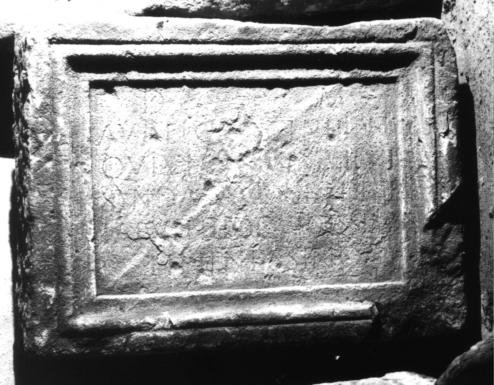

# EDH HD047400. Colonia Ulpia Traiana Sarmizegetusa

**Країна.** Румунія

**Провінція (код EDH).** Dac

**Місце знахідки (антична назва).** Colonia Ulpia Traiana Sarmizegetusa

**Сучасна назва.** Sarmizegetusa

**Координати.** 45.516666699,22.783333299

**Зберігання.** Deva, Muz. Civil. Dac. şi Rom.

**Датування (роки, від'ємні до н. е.).** 151 … 250

**Тип пам'ятки.** Tafel

**Розміри (висота, ширина, глибина, см).** 76.0 × 58.0 × 15.0

## Текст (латинь, скорочення розкрито)

```
D(is) M(anibus) / Aurel(i)o Cimion(i) / qui vix[it] ann(os) [---] m(enses) VI d(ies) XI / Synda(?) [scr]iba t[abu]/lari(i) filio dulcissi/[mo] et pientissimo p(osuit)
```

## Текст у вихідному записі

```
D M / AVRELO CIMION / QVI VIX[ ] ANN [ ] M VI D XI / SYNDA [ ]IBA T[ ] / LARI FILIO DVLCISSI / [ ] ET PIENTISSIMO P
```

## Література

CIL 03, 07975.
- IDR 3, 2, 386; fig. 311. #

## Фото



Джерело https://edh.ub.uni-heidelberg.de/edh/inschrift/HD047400, ліцензія CC BY-SA 4.0. Оригінальний XML в архіві сирі_дані/edh_xml.zip
