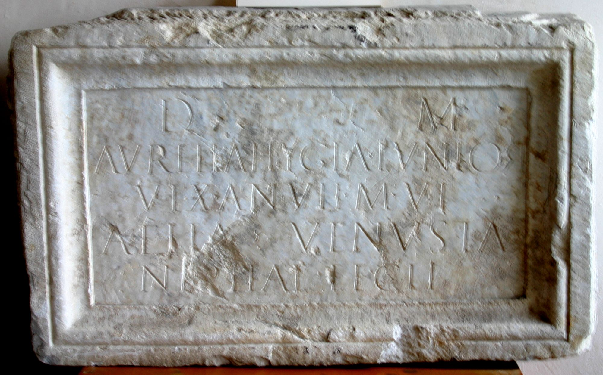

# EDH HD047405. Colonia Ulpia Traiana Sarmizegetusa

**Країна.** Румунія

**Провінція (код EDH).** Dac

**Місце знахідки (антична назва).** Colonia Ulpia Traiana Sarmizegetusa

**Сучасна назва.** Sarmizegetusa

**Координати.** 45.516666699,22.783333299

**Рік знахідки.** 1964

**Зберігання.** Sarmizegetusa, Muz. Arh.

**Датування (роки, від'ємні до н. е.).** 151 … 250

**Тип пам'ятки.** Tafel

**Розміри (висота, ширина, глибина, см).** 56.0 × 90.0 × 5.0

## Текст (латинь, скорочення розкрито)

```
D(is) M(anibus) / Aurelia Hygia Iunior / vix(it) an(nos) VII m(enses) VI / Aelia Venusta / neptiae fecit
```

## Текст у вихідному записі

```
D M / AVRELIA HYGIA IVNIOR / VIX AN VII M VI / AELIA VENVSTA / NEPTIAE FECIT
```

## Література

IDR 3, 2, 392; fig. 316 (Foto u. Zeichnung). #

## Фото



Джерело https://edh.ub.uni-heidelberg.de/edh/inschrift/HD047405, ліцензія CC BY-SA 4.0. Оригінальний XML в архіві сирі_дані/edh_xml.zip
