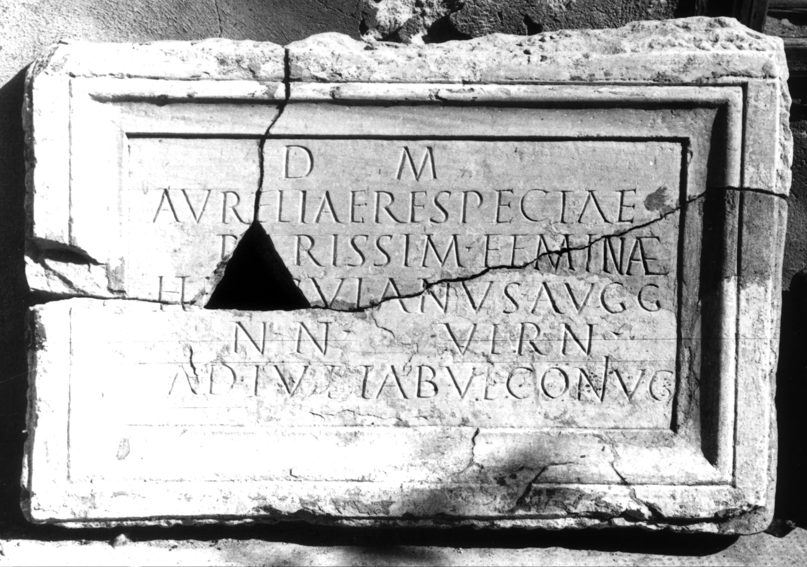

# EDH HD047408. Colonia Ulpia Traiana Sarmizegetusa, aus

**Країна.** Румунія

**Провінція (код EDH).** Dac

**Місце знахідки (антична назва).** Colonia Ulpia Traiana Sarmizegetusa, aus

**Сучасна назва.** General Berthelot

**Деталі знахідки.** {Schloss Nopcsa}

**Координати.** 45.613467662,22.885032684

**Рік знахідки.** -1857

**Зберігання.** Deva, Muz. Civil. Dac. şi Rom.

**Датування (роки, від'ємні до н. е.).** 169 … 211

**Тип пам'ятки.** Tafel

**Розміри (висота, ширина, глибина, см).** 60.0 × 95.0 × 10.0

## Текст (латинь, скорочення розкрито)

```
D(is) M(anibus) / Aureliae Respectae / rarissim(ae) feminae / Herculanus Augg(ustorum) / nn(ostrorum) vern(a) / adiut(or) tabul(arii) coniug(i)
```

## Текст у вихідному записі

```
D M / AVRELIAE RESPECTAE / RARISSIM FEMINAE / HERCVLANVS AVGG / NN VERN / ADIVT TABVL CONIVG
```

## Література

CIL 03, 01468.
- IDR 3, 2, 395; fig. 318 (Foto u. Zeichnung). #

## Фото



Джерело https://edh.ub.uni-heidelberg.de/edh/inschrift/HD047408, ліцензія CC BY-SA 4.0. Оригінальний XML в архіві сирі_дані/edh_xml.zip
