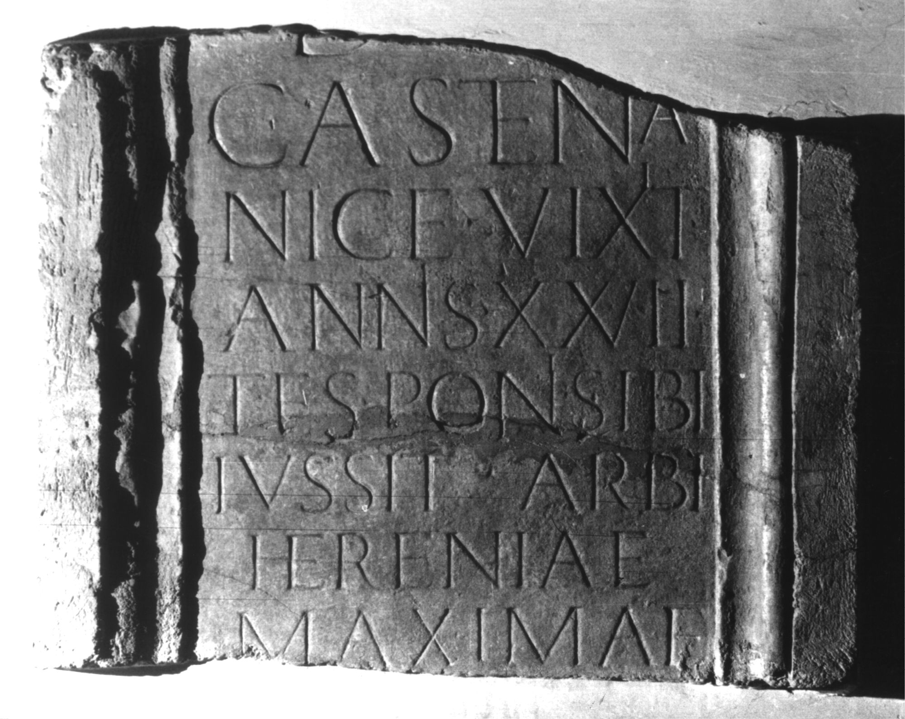

# EDH HD047431. Colonia Ulpia Traiana Sarmizegetusa, aus

**Країна.** Румунія

**Провінція (код EDH).** Dac

**Місце знахідки (антична назва).** Colonia Ulpia Traiana Sarmizegetusa, aus

**Сучасна назва.** Totești

**Деталі знахідки.** {Cârneşti}

**Координати.** 45.5489865,22.864494799

**Рік знахідки.** 1722

**Зберігання.** Wien, Nationalbibl.

**Датування (роки, від'ємні до н. е.).** 107 … 200

**Матеріал.** Marmor

**Тип пам'ятки.** Tafel?

**Розміри (висота, ширина, глибина, см).** -83.0 × 106.0

## Текст (латинь, скорочення розкрито)

```
D(is) [M(anibus)] / Castena / Nice vixit / annis XXVII / tes(tamento) poni sibi / iussit arbi(tratu) / Heren(n)iae / Maximae / [&
```

## Текст у вихідному записі

```
D [ ] / CASTENA / NICE VIXIT / ANNIS XXVII / TES PONI SIBI / IVSSIT ARBI / HERENIAE / MAXIMAE / [
```

## Коментар

Autopsie: Buonopane, 2009. (B): Weber: Z. 2: Casten[i]a; Z. 7: Herenniae.

## Література

CIL 03, 01530.
- IDR 3, 2, 399; fig. 322 (Foto u. Zeichnung).
- A. Buonopane - V. La Monaca, in: G.P. Marchi - J. Pál (Hrsg.), Epigrafi romane di Transilvania. Bibliotheca Capitolare di Verona, Manoscritto CCLXVII (Verona - Szeged 2010) 263, Nr. 10; Foto u. Zeichnung.
- F. Beutler - E. Weber (Hrsg.), Die römischen Inschriften der Österreichischen Nationalbibliothek (Wien 2015) 62, Nr. 45; Foto.
- E. Weber, Tyche 30, 2015, 263-264, Nr. 55; Foto. (B) #

## Фото



Джерело https://edh.ub.uni-heidelberg.de/edh/inschrift/HD047431, ліцензія CC BY-SA 4.0. Оригінальний XML в архіві сирі_дані/edh_xml.zip
