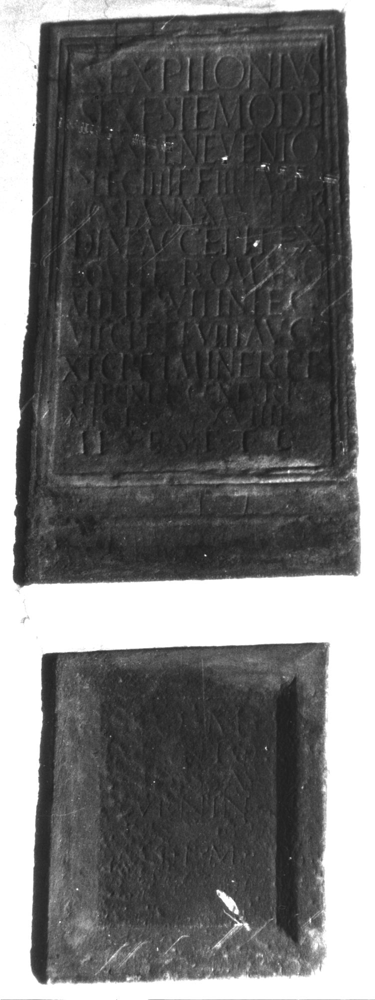

# EDH HD047677. Colonia Ulpia Traiana Sarmizegetusa, aus

**Країна.** Румунія

**Провінція (код EDH).** Dac

**Місце знахідки (антична назва).** Colonia Ulpia Traiana Sarmizegetusa, aus

**Сучасна назва.** Râu de Mori

**Деталі знахідки.** {Ostrov}

**Координати.** 45.527899300,22.846715000

**Рік знахідки.** -1723

**Зберігання.** Wien, Nationalbibl.

**Датування (роки, від'ємні до н. е.).** 107 … 200

**Тип пам'ятки.** Tafel

## Текст (латинь, скорочення розкрито)

```
Sex(tus) Pilonius / Sex(ti) f(ilius) Ste(llatina) Mode/stus Benevento / |(centurio) leg(ionis) IIII F(laviae) F(elicis) III hast(atus) / post(erior) ann(orum) XXXVII or/dine(m) accepit ex / equite Romano / militavit in leg(ione) / VII C(laudia) p(ia) f(ideli) et VIII Aug(usta) / XI C(laudia) p(ia) f(ideli) I Miner(via) p(ia) f(ideli) / stipendi(i)s centurio/nicis XVIIII / h(ic) s(itus) e(st) s(it) t(ibi) t(erra) l(evis)
```

## Текст у вихідному записі

```
SEX PILONIVS / SEX F STE MODE / STVS BENEVENTO / | LEG IIII F F III HAST / POST ANN XXXVII OR / DINE ACCEPIT EX / EQVITE ROMANO / MILITAVIT IN LEG / VII C P F ET VIII AVG / XI C P F I MINER P F / STIPENDIS CENTVRIO / NICIS XVIIII / H S E S T T L
```

## Коментар

Autopsie: Buonopane, 2009.

## Література

CIL 03, 01480.
- ILS 2654.
- IDR 3, 2, 437; fig. 347 (Zeichnung).
- A. Buonopane - V. La Monaca, in: G.P. Marchi - J. Pál (Hrsg.), Epigrafi romane di Transilvania. Bibliotheca Capitolare di Verona, Manoscritto CCLXVII (Verona - Szeged 2010) 266, Nr. 13; Foto u. Zeichnung.
- F. Beutler - E. Weber (Hrsg.), Die römischen Inschriften der Österreichischen Nationalbibliothek (Wien 2015) 58, Nr. 41; Foto.
- R. Cubaynes, Les hommes de la VIIIe légion Auguste (Autun 2018) 529-531, Nr. 157; Foto. #

## Фото



Джерело https://edh.ub.uni-heidelberg.de/edh/inschrift/HD047677, ліцензія CC BY-SA 4.0. Оригінальний XML в архіві сирі_дані/edh_xml.zip
