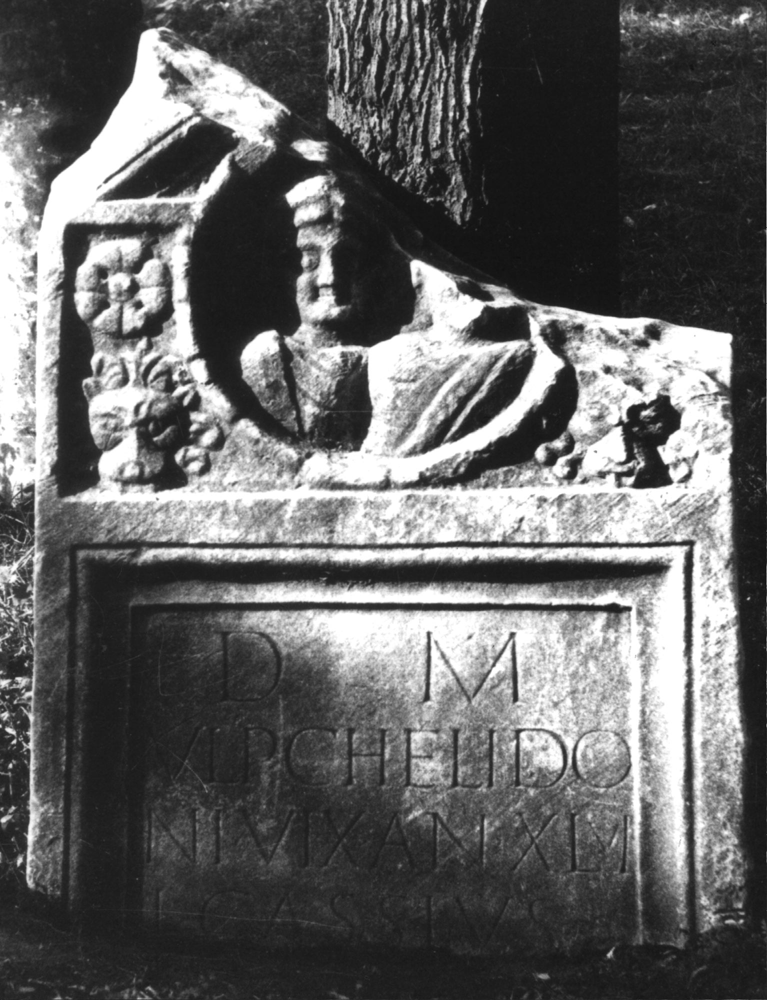

# EDH HD047686. Colonia Ulpia Traiana Sarmizegetusa

**Країна.** Румунія

**Провінція (код EDH).** Dac

**Місце знахідки (антична назва).** Colonia Ulpia Traiana Sarmizegetusa

**Сучасна назва.** Sarmizegetusa

**Координати.** 45.516666699,22.783333299

**Зберігання.** Deva, Muz. Civil. Dac. şi Rom.

**Датування (роки, від'ємні до н. е.).** 107 … 270

**Тип пам'ятки.** Stele

**Розміри (висота, ширина, глибина, см).** -119.0 × 89.0 × 19.0

## Текст (латинь, скорочення розкрито)

```
D(is) M(anibus) / Ulp(io) Chelido/ni vix(it) an(nos) XLVI / L(ucius) Cassius / [&
```

## Текст у вихідному записі

```
D M / VLP CHELIDO / NI VIX AN XLVI / L CASSIVS / [
```

## Література

CIL 03, 12591.
- IDR 3, 2, 446; fig. 353 (Foto u. Zeichnung). #

## Фото



Джерело https://edh.ub.uni-heidelberg.de/edh/inschrift/HD047686, ліцензія CC BY-SA 4.0. Оригінальний XML в архіві сирі_дані/edh_xml.zip
