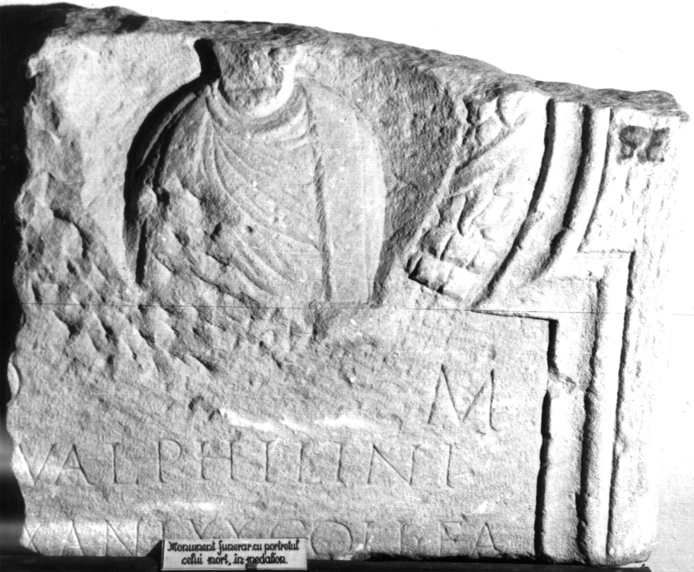

# EDH HD047841. Colonia Ulpia Traiana Sarmizegetusa

**Країна.** Румунія

**Провінція (код EDH).** Dac

**Місце знахідки (антична назва).** Colonia Ulpia Traiana Sarmizegetusa

**Сучасна назва.** Sarmizegetusa

**Координати.** 45.516666699,22.783333299

**Зберігання.** Sarmizegetusa, Muz. Arh.

**Датування (роки, від'ємні до н. е.).** 107 … 270

**Тип пам'ятки.** Stele

**Розміри (висота, ширина, глибина, см).** -73.0 × -60.0 × 20.0

## Текст (латинь, скорочення розкрито)

```
D(is) M(anibus) / [-] Val(eri) Philini / [vi]x(it) an(nos) LXX coll(egium) fa/[brum &
```

## Текст у вихідному записі

```
D M / [ ] VAL PHILINI / [ ]X AN LXX COLL FA / [
```

## Література

IDR 3, 2, 456; fig. 360 (Foto u. Zeichnung). #

## Фото



Джерело https://edh.ub.uni-heidelberg.de/edh/inschrift/HD047841, ліцензія CC BY-SA 4.0. Оригінальний XML в архіві сирі_дані/edh_xml.zip
