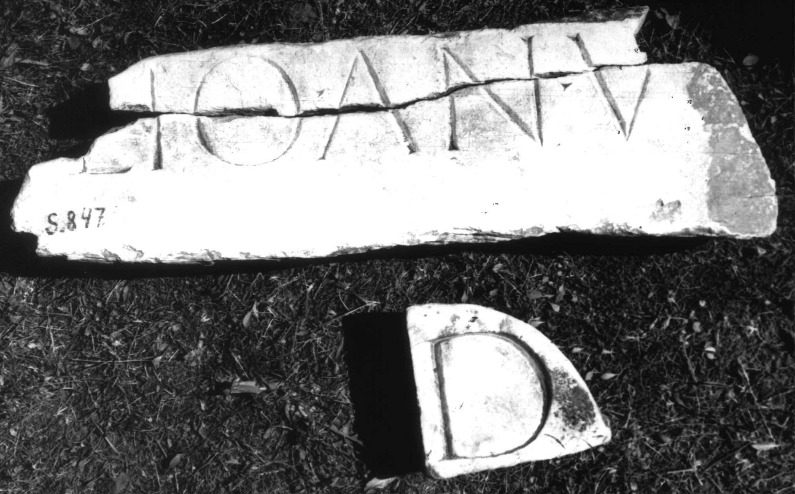
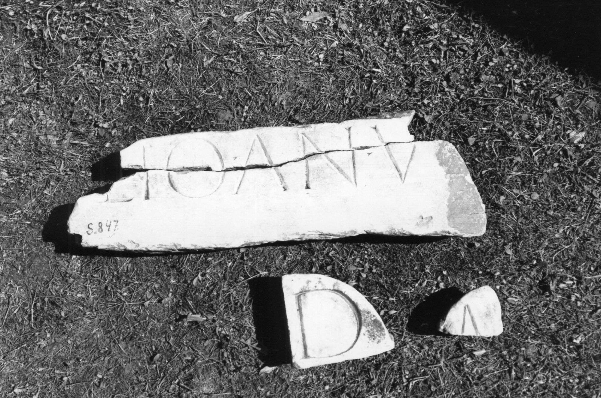

# EDH HD047847. Colonia Ulpia Traiana Sarmizegetusa

**Країна.** Румунія

**Провінція (код EDH).** Dac

**Місце знахідки (антична назва).** Colonia Ulpia Traiana Sarmizegetusa

**Сучасна назва.** Sarmizegetusa

**Координати.** 45.516666699,22.783333299

**Зберігання.** Sarmizegetusa, Muz. Arh.

**Датування (роки, від'ємні до н. е.).** 107 … 270

**Тип пам'ятки.** Sarkophag

**Розміри (висота, ширина, глибина, см).** 6.8 × 19.0 × 15.5

## Текст (латинь, скорочення розкрито)

```
D(is) [M(anibus)] / [---]lio an(norum) V[&
```

## Текст у вихідному записі

```
D [ ] / [ ]LIO AN V[
```

## Коментар

Vier teilweise aneinander passende Fragmente erhalten. Abmessungen des größten, aus zwei Fragmenten zusammengesetzten Stücks: s.o.; Abmessungen der beiden übrigen Fragmente: 15.7 x 17 x 12.5, 8.5 x. 10 x. 10.5.

## Література

IDR 3, 2, 463; fig. 364 (Fotos u. Zeichnungen). #

## Фото





Джерело https://edh.ub.uni-heidelberg.de/edh/inschrift/HD047847, ліцензія CC BY-SA 4.0. Оригінальний XML в архіві сирі_дані/edh_xml.zip
