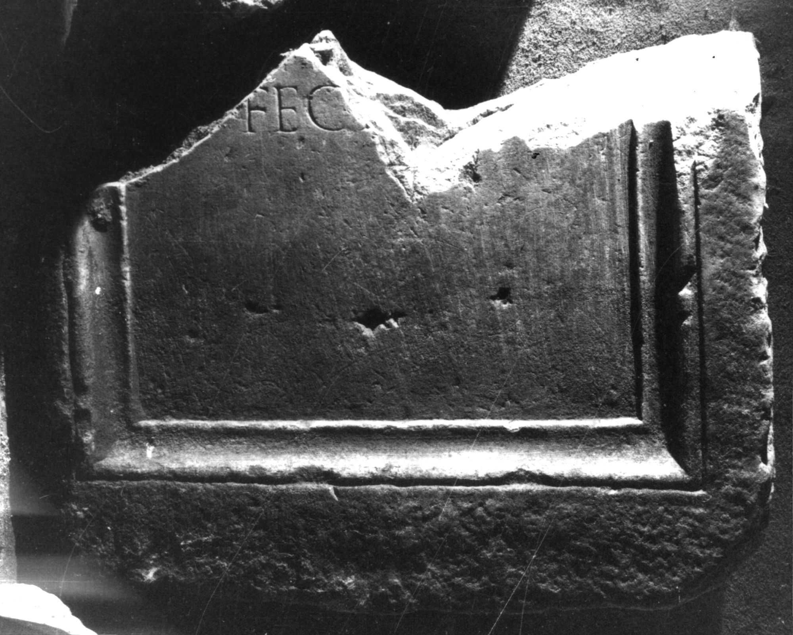

# EDH HD047852. Colonia Ulpia Traiana Sarmizegetusa

**Країна.** Румунія

**Провінція (код EDH).** Dac

**Місце знахідки (антична назва).** Colonia Ulpia Traiana Sarmizegetusa

**Сучасна назва.** Sarmizegetusa

**Координати.** 45.516666699,22.783333299

**Зберігання.** Deva, Muz. Civil. Dac. şi Rom.

**Датування (роки, від'ємні до н. е.).** 107 … 270

**Тип пам'ятки.** Stele?

**Розміри (висота, ширина, глибина, см).** -68.0 × -85.0 × 20.0

## Текст (латинь, скорочення розкрито)

```
$] / feci[t b(ene) m(erenti)]
```

## Текст у вихідному записі

```
] / FECI[ ]
```

## Література

IDR 3, 2, 469; fig. 369 (Foto u. Zeichnung). #

## Фото



Джерело https://edh.ub.uni-heidelberg.de/edh/inschrift/HD047852, ліцензія CC BY-SA 4.0. Оригінальний XML в архіві сирі_дані/edh_xml.zip
