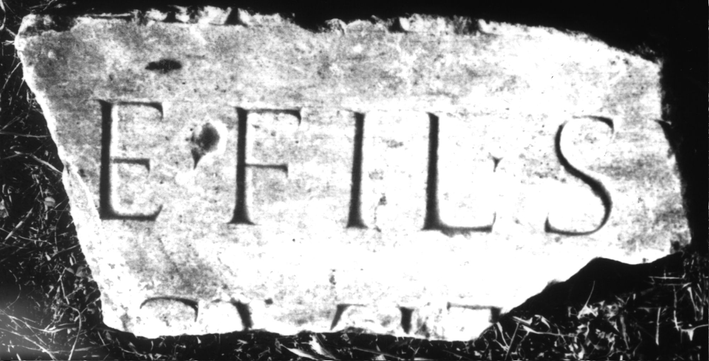

# EDH HD047853. Colonia Ulpia Traiana Sarmizegetusa

**Країна.** Румунія

**Провінція (код EDH).** Dac

**Місце знахідки (антична назва).** Colonia Ulpia Traiana Sarmizegetusa

**Сучасна назва.** Sarmizegetusa

**Координати.** 45.516666699,22.783333299

**Зберігання.** Deva, Muz. Civil. Dac. şi Rom.

**Датування (роки, від'ємні до н. е.).** 107 … 270

**Тип пам'ятки.** Tafel

**Розміри (висота, ширина, глибина, см).** -32.0 × -16.0 × 6.0

## Текст (латинь, скорочення розкрито)

```
$] / [---]e fil(iae) su[ae] / [--- b(ene)? m(erenti)? po]suit
```

## Текст у вихідному записі

```
] / [ ]E FIL SV[ ] / [ ]SVIT
```

## Література

CIL 03, 07990.
- IDR 3, 2, 470; fig. 370 (Foto u. Zeichnung). #

## Фото



Джерело https://edh.ub.uni-heidelberg.de/edh/inschrift/HD047853, ліцензія CC BY-SA 4.0. Оригінальний XML в архіві сирі_дані/edh_xml.zip
