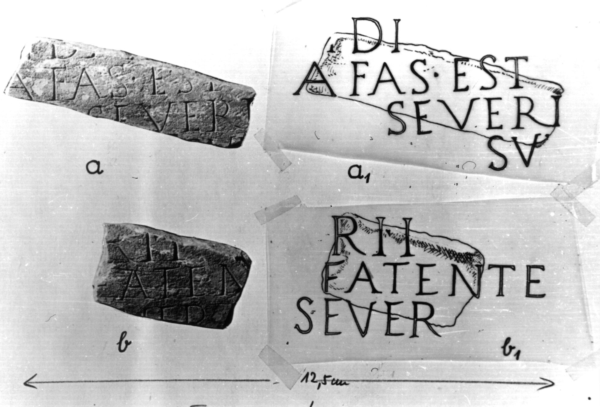

# EDH HD047913. Colonia Ulpia Traiana Sarmizegetusa

**Країна.** Румунія

**Провінція (код EDH).** Dac

**Місце знахідки (антична назва).** Colonia Ulpia Traiana Sarmizegetusa

**Сучасна назва.** Sarmizegetusa

**Координати.** 45.516666699,22.783333299

**Зберігання.** Sarmizegetusa, Muz. Arh.

**Датування (роки, від'ємні до н. е.).** 151 … 270

**Тип пам'ятки.** Tafel

**Розміри (висота, ширина, глибина, см).** 11.0 × 37.0 × 5.0

## Текст (латинь, скорочення розкрито)

```
$]N DA[---] / [---]A fas est [---] / [---] Severi / [---]S(?)V[& // $]RI I[---] / [---] faten[---] / [---]ver[&
```

## Текст у вихідному записі

```
]N DA[ ] / [ ]A FAS EST [ ] / [ ] SEVERI / [ ]SV[ / / ]RI I[ ] / [ ] FATEN[ ] / [ ]VER[
```

## Коментар

Zwei nicht aneinander passende Fragmente erhalten. Abmessungen des einen Fragments: s. o.; Abmessungen des zweiten Fragments: 13 x 21 x 5. Möglicherweise eine metrische Inschrift.

## Література

IDR 3, 2, 491; fig. 379 (Fotos u. Zeichnungen)

## Фото



Джерело https://edh.ub.uni-heidelberg.de/edh/inschrift/HD047913, ліцензія CC BY-SA 4.0. Оригінальний XML в архіві сирі_дані/edh_xml.zip
