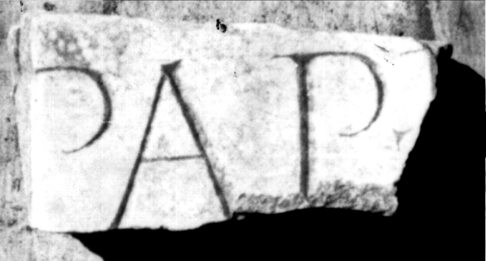

# EDH HD047919. Colonia Ulpia Traiana Sarmizegetusa

**Країна.** Румунія

**Провінція (код EDH).** Dac

**Місце знахідки (антична назва).** Colonia Ulpia Traiana Sarmizegetusa

**Сучасна назва.** Sarmizegetusa

**Координати.** 45.516666699,22.783333299

**Зберігання.** Sarmizegetusa, Muz. Arh.

**Датування (роки, від'ємні до н. е.).** 107 … 270

**Тип пам'ятки.** Tafel

**Розміри (висота, ширина, глибина, см).** 8.0 × 15.0 × 5.5

## Текст (латинь, скорочення розкрито)

```
$] Pap(iria) I[&
```

## Текст у вихідному записі

```
] PAP I[
```

## Література

IDR 3, 2, 498; fig. 382. #

## Фото



Джерело https://edh.ub.uni-heidelberg.de/edh/inschrift/HD047919, ліцензія CC BY-SA 4.0. Оригінальний XML в архіві сирі_дані/edh_xml.zip
