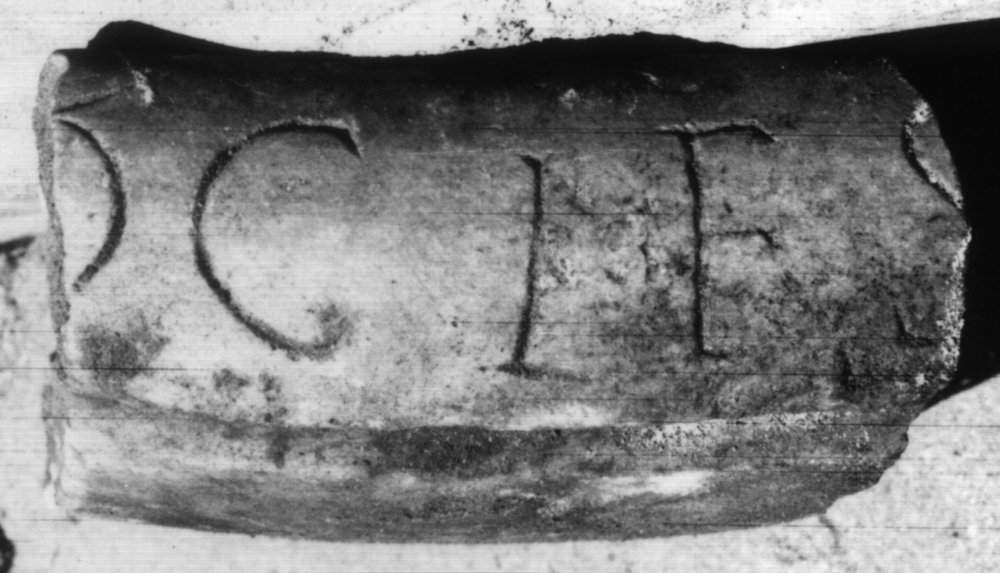

# EDH HD047926. Colonia Ulpia Traiana Sarmizegetusa

**Країна.** Румунія

**Провінція (код EDH).** Dac

**Місце знахідки (антична назва).** Colonia Ulpia Traiana Sarmizegetusa

**Сучасна назва.** Sarmizegetusa

**Деталі знахідки.** {Amphitheater}

**Координати.** 45.516685035,22.785926378

**Зберігання.** Deva, Muz. Civil. Dac. şi Rom.

**Датування (роки, від'ємні до н. е.).** 107 … 270

**Матеріал.** Ton

**Тип пам'ятки.** instrdom

**Розміри (висота, ширина, глибина, см).** -4.0

## Текст (латинь, скорочення розкрито)

```
[Di]ocles
```

## Текст у вихідному записі

```
[ ]OCLES
```

## Коментар

Amphore mit gestempelter Inschrift.

## Література

CIL 03, 13791.
- IDR 3, 2, 576; fig. 420 (Foto u. Zeichnung). #

## Фото



Джерело https://edh.ub.uni-heidelberg.de/edh/inschrift/HD047926, ліцензія CC BY-SA 4.0. Оригінальний XML в архіві сирі_дані/edh_xml.zip
