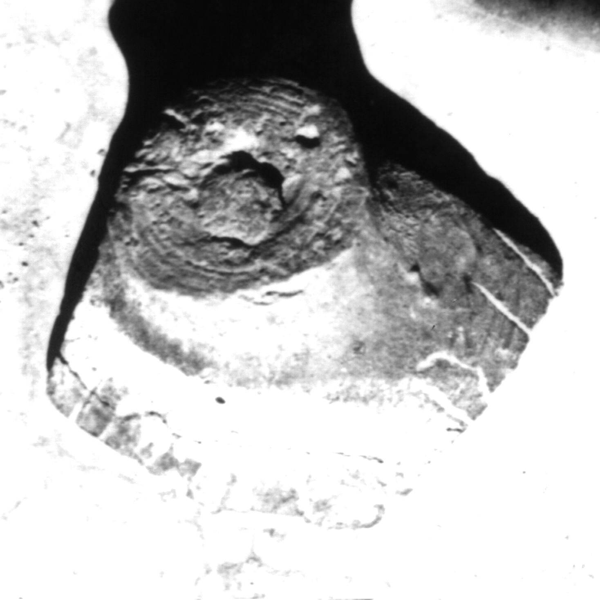

# EDH HD047928. Colonia Ulpia Traiana Sarmizegetusa, bei

**Країна.** Румунія

**Провінція (код EDH).** Dac

**Місце знахідки (антична назва).** Colonia Ulpia Traiana Sarmizegetusa, bei

**Сучасна назва.** Sarmizegetusa

**Деталі знахідки.** {Mausoleum der Aurelier}?

**Координати.** 45.517108361,22.797589238

**Зберігання.** Sarmizegetusa, Muz. Arh.

**Датування (роки, від'ємні до н. е.).** 107 … 270

**Матеріал.** Ton

**Тип пам'ятки.** instrdom

## Текст (латинь, скорочення розкрито)

```
Victorin[i ---?]
```

## Текст у вихідному записі

```
VICTORIN[ ]
```

## Коментар

In den Deckel eines Tongefäßes geritzt.

## Література

IDR 3, 2, 582; fig. 423 (Zeichnung). #

## Фото



Джерело https://edh.ub.uni-heidelberg.de/edh/inschrift/HD047928, ліцензія CC BY-SA 4.0. Оригінальний XML в архіві сирі_дані/edh_xml.zip
