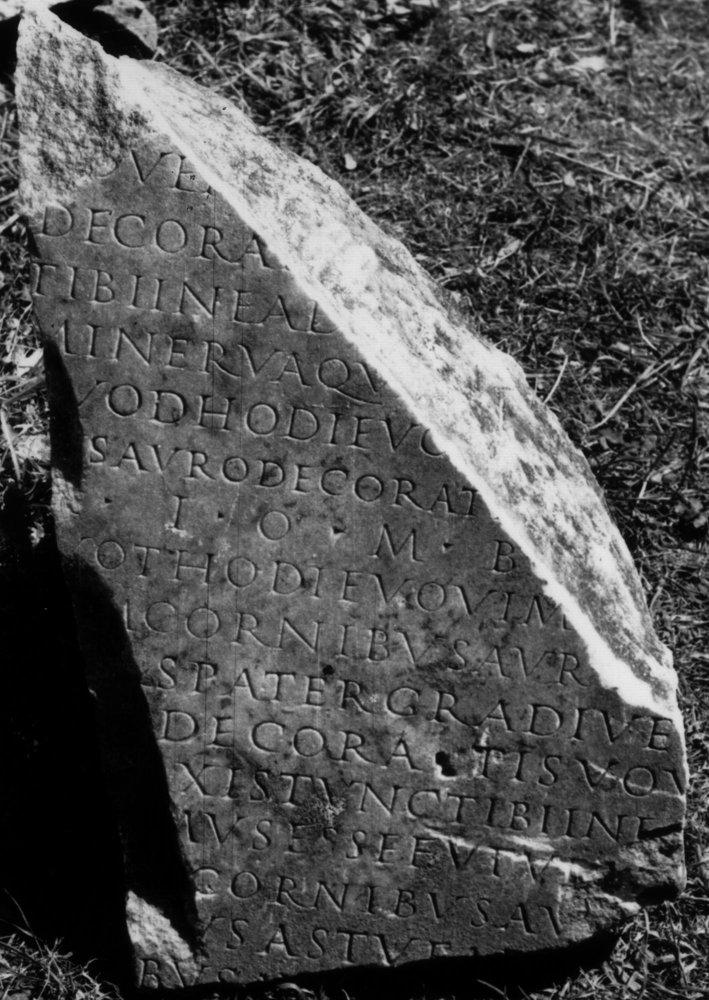

# EDH HD047930. Colonia Ulpia Traiana Sarmizegetusa

**Країна.** Румунія

**Провінція (код EDH).** Dac

**Місце знахідки (антична назва).** Colonia Ulpia Traiana Sarmizegetusa

**Сучасна назва.** Sarmizegetusa

**Деталі знахідки.** {Provinzialforum}

**Координати.** 45.516962857,22.788283824

**Рік знахідки.** 1964

**Зберігання.** Sarmizegetusa, Muz. Arh.

**Датування (роки, від'ємні до н. е.).** 151 … 200

**Тип пам'ятки.** Tafel

**Розміри (висота, ширина, глибина, см).** -47.0 × -30.0 × 16.5

## Текст (латинь, скорочення розкрито)

```
$ astu ea ita faxis tunc tibi bovem cornibus auro decoratis] / [v]ovem[us esse futurum Iuno Regina quae in verba I(ovi) O(ptimo) M(aximo) bovem cornibus auro] / decorat[is vovimus esse futurum quod hodie vovimus astu ea ita faxis tunc] / tibi in ead[em verba bovem cornibus auro decoratis vovemus esse futuram] / Minerva qu[ae in verba I(ovi) O(ptimo) M(aximo) bovem cornibus auro decoratis vovimus esse futurum] / [q]uod hodie vo[vimus astu ea ita faxis tunc tibi in eadem verba bovem corni]/[b]us auro decorati[s vovemus esse futurum Salus publica p(opuli) R(omani) Q(uiritium) quae in ver]/[b]a I(ovi) O(ptimo) M(aximo) bo[vem cornibus auro decoratis vovimus ese futurum] / [q]uot hodie vovim[us astu ea ita faxis tunc tibi in eadem verba bo]/[ve]m cornibus auro [decoratis vovemus esse futurum Invicte] / [Ma]rs Pater Gradive [quae in verba I(ovi) O(ptimo) M(aximo) bovem cornibus] / [auro] decoratis vov[imus esse futurum quod hodie vovimus astu ea] / [ita fa]xis tunc tibi in e[adem verba taurum cornibus auro decoratis] / [vove]mus esse futur[um Fortuna Redux quae in verba I(ovi) O(ptimo) M(aximo)] / [bovem] cornibus au[ro decoratis vovimus esse futurum quod hodie] / [vovim]us astu ea [ita faxis tunc tibi in eadem verba bovem] / [cornib]us au[ro decoratis vovemus esse futurum &
```

## Текст у вихідному записі

```
] / [ ]OVEM[ ] / DECORAT[ ] / TIBI IN EAD[ ] / MINERVA QV[ ] / [ ]VOD HODIE VO[ ] / [ ]VS AVRO DECORATI[ ] / [ ]A I O M BO[ ] / [ ]VOT HODIE VOVIM[ ] / [ ]M CORNIBVS AVRO [ ] / [ ]RS PATER GRADIVE [ ] / [ ] DECORATIS VOV[ ] / [ ]XIS TVNC TIBI IN E[ ] / [ ]MVS ESSE FVTVR[ ] / [ ] CORNIBVS AV[ ] / [ ]VS ASTV EA [ ] / [ ]VS AV[
```

## Коментар

Textwiedergabe / -ergänzung nach IDR in Anlehnung an die vota der Acta Fratrum Arvalium. Nach Mărghitan - Petolescu könnte es sich um vota zum Heil der Hauptstadt der Provinz Dakien (Sarmizegetusa) handeln.

## Література

I. Piso, RRoumHist 13, 1974, 723-733; fig. 2.
- L. Mărghitan - C.C. Petolescu, JRS 66, 1976, 84-86; pl. 7.
- IDR 3, 2, 241; fig. 195 (Foto u. Zeichnung). #

## Фото



Джерело https://edh.ub.uni-heidelberg.de/edh/inschrift/HD047930, ліцензія CC BY-SA 4.0. Оригінальний XML в архіві сирі_дані/edh_xml.zip
