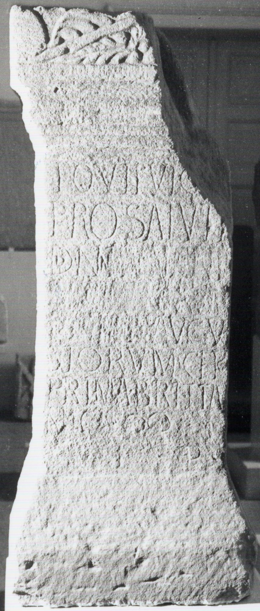

# EDH HD048407. Samum

**Країна.** Румунія

**Провінція (код EDH).** Dac

**Місце знахідки (антична назва).** Samum

**Сучасна назва.** Căşeiu

**Координати.** 47.196619299,23.857412299

**Датування (роки, від'ємні до н. е.).** 217 … 253

## Текст (латинь, скорочення розкрито)

```
Iovi Fulg(uratori) / pro salute / dd(ominorum) nn(ostrorum) [[[---]]] / [[[------]]] / [[[---]]] Augu/storum c(o)ho(rs) / prima Britta/n(n)ica |(milliaria) / v(otum) l(ibens) p(osuit)
```

## Текст у вихідному записі

```
IOVI FVLG / PRO SALVTE / DD NN [[[ ]]] / [[[ ]]] / [[[ ]]] AVGV / STORVM CHO / PRIMA BRITTA / NICA | / V L P
```

## Коментар

(B): CIL III: Z. 6 (Ende): CH.

## Література

CIL 03, 00821. (B) #

## Фото



Джерело https://edh.ub.uni-heidelberg.de/edh/inschrift/HD048407, ліцензія CC BY-SA 4.0. Оригінальний XML в архіві сирі_дані/edh_xml.zip
