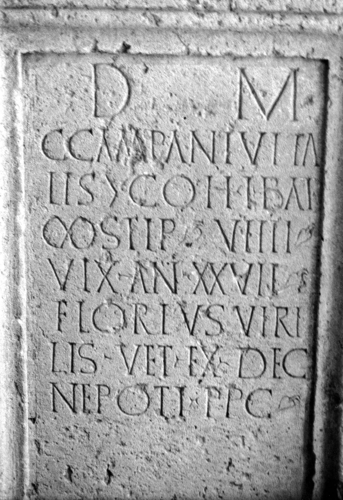

# EDH HD048569. Certiae, bei

**Країна.** Румунія

**Провінція (код EDH).** Dac

**Місце знахідки (антична назва).** Certiae, bei

**Сучасна назва.** Românaşi

**Деталі знахідки.** {Romita}

**Координати.** 47.1468733,23.202278100

**Зберігання.** Cluj-Napoca, Muz. Naţ. Ist. Transilv.

**Датування (роки, від'ємні до н. е.).** 171 … 270

**Тип пам'ятки.** Altar?

## Текст (латинь, скорочення розкрито)

```
D(is) M(anibus) / C(ai) Campani Vita/lis |(centurionis) coh(ortis) I Bat(avorum) / |(milliariae) stip(endiorum) VIIII / vix(it) an(nos) XXVII / Florius Viri/lis vet(eranus) ex dec(urione) / nepoti p(ientissimo) p(onendum) c(uravit)
```

## Текст у вихідному записі

```
D M / C CAMPANI VITA / LIS | COH I BAT / | STIP VIIII / VIX AN XXVII / FLORIVS VIRI / LIS VET EX DEC / NEPOTI P P C
```

## Коментар

Mittelteil eines Altars oder einer Statuenbasis. Hederae.

## Література

CIL 03, 00839.
- ILS 2598. #

## Фото



Джерело https://edh.ub.uni-heidelberg.de/edh/inschrift/HD048569, ліцензія CC BY-SA 4.0. Оригінальний XML в архіві сирі_дані/edh_xml.zip
