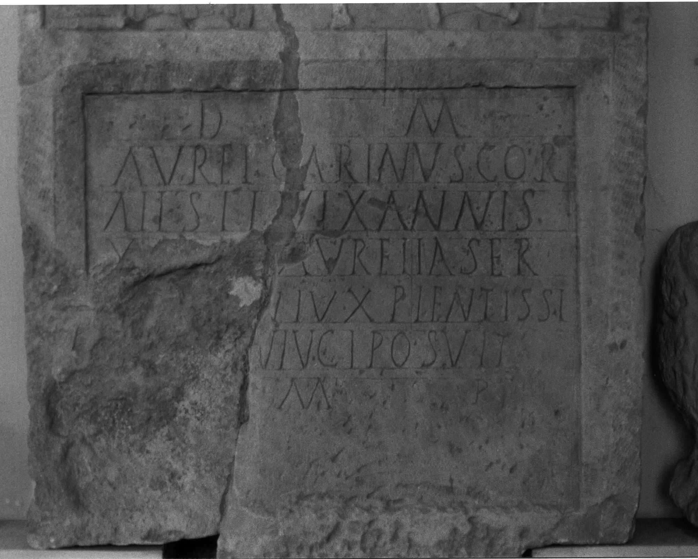

# EDH HD048651. Gilău

**Країна.** Румунія

**Провінція (код EDH).** Dac

**Сучасна назва.** Gilău

**Координати.** 46.75,23.383332999

**Зберігання.** Cluj-Napoca, Muz. Naţ. Ist. Transilv.

**Датування (роки, від'ємні до н. е.).** 161 … 270

**Тип пам'ятки.** Stele

## Текст (латинь, скорочення розкрито)

```
D(is) M(anibus) / Aurel(ius) Carinus cor(nicularius) / a<l=I>(a)<e=I>#a<l>(a)<e>#AII Sil(ianae) vix(it) annis / [---] Aurelia Ser/[--- co]niux pientissi(mo) / [co]niugi posuit / [b(ene)] m(erenti)
```

## Текст у вихідному записі

```
D M / AVREL CARINVS COR / AII SIL VIX ANNIS / [ ] AVRELIA SER / [ ]NIVX PIENTISSI / [ ]NIVGI POSVIT / [ ] M
```

## Література

CIL 03, 07651; Zeichnung.
- CIL 03, 00847a. #

## Фото



Джерело https://edh.ub.uni-heidelberg.de/edh/inschrift/HD048651, ліцензія CC BY-SA 4.0. Оригінальний XML в архіві сирі_дані/edh_xml.zip
