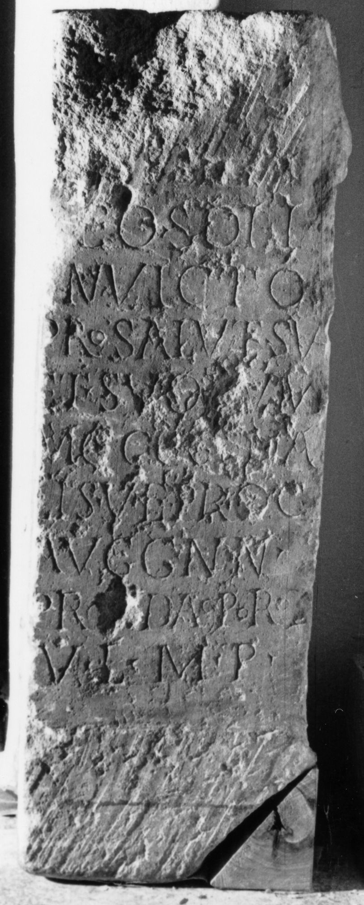

# EDH HD048703. Napoca

**Країна.** Румунія

**Провінція (код EDH).** Dac

**Місце знахідки (антична назва).** Napoca

**Сучасна назва.** Cluj-Napoca

**Деталі знахідки.** {Brückentor}, sekundär verwendet

**Координати.** 46.76667,23.6

**Зберігання.** Cluj-Napoca, Muz. Naţ. Ist. Transilv.

**Датування (роки, від'ємні до н. е.).** 161 … 211

## Текст (латинь, скорочення розкрито)

```
[D]eo Soli / [I]nvicto / pro salute sua / et suorum / M(arcus) Cocc(eius) Genia/lis v(ir) e(gregius) proc(urator) / Augg(ustorum) nn(ostrorum) / prov(inciae) Dac(iae) Poro(lissensis) / v(otum) l(ibens) m(erito) p(osuit)
```

## Текст у вихідному записі

```
[ ]EO SOLI / [ ]NVICTO / PRO SALVTE SVA / ET SVORVM / M COCC GENIA / LIS V E PROC / AVGG NN / PROV DAC PORO / V L M P
```

## Література

CIL 03, 07662.
- PIR (2. Aufl.) C 1217. #

## Фото



Джерело https://edh.ub.uni-heidelberg.de/edh/inschrift/HD048703, ліцензія CC BY-SA 4.0. Оригінальний XML в архіві сирі_дані/edh_xml.zip
