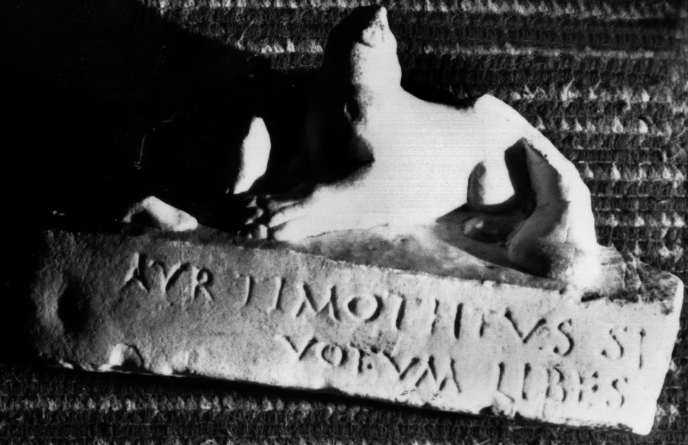

# EDH HD048820. Potaissa, bei

**Країна.** Румунія

**Провінція (код EDH).** Dac

**Місце знахідки (антична назва).** Potaissa, bei

**Сучасна назва.** Poşaga

**Координати.** 46.446616314,23.419965502

**Зберігання.** Turda, Muz. Ist.

**Датування (роки, від'ємні до н. е.).** 151 … 270

**Тип пам'ятки.** Statuenbasis

**Розміри (висота, ширина, глибина, см).** -17.0 × -80.0 × -28.0

## Текст (латинь, скорочення розкрито)

```
A<u=Y>r(elius)#A<u>r(elius)#AYR Timotheus sig[num Liberi ---] / votum libe(n)s [merito? solvit?]
```

## Текст у вихідному записі

```
AYR TIMOTHEVS SIG[ ] / VOTVM LIBES [ ]
```

## Література

CIL 03, 07683. #

## Фото



Джерело https://edh.ub.uni-heidelberg.de/edh/inschrift/HD048820, ліцензія CC BY-SA 4.0. Оригінальний XML в архіві сирі_дані/edh_xml.zip
