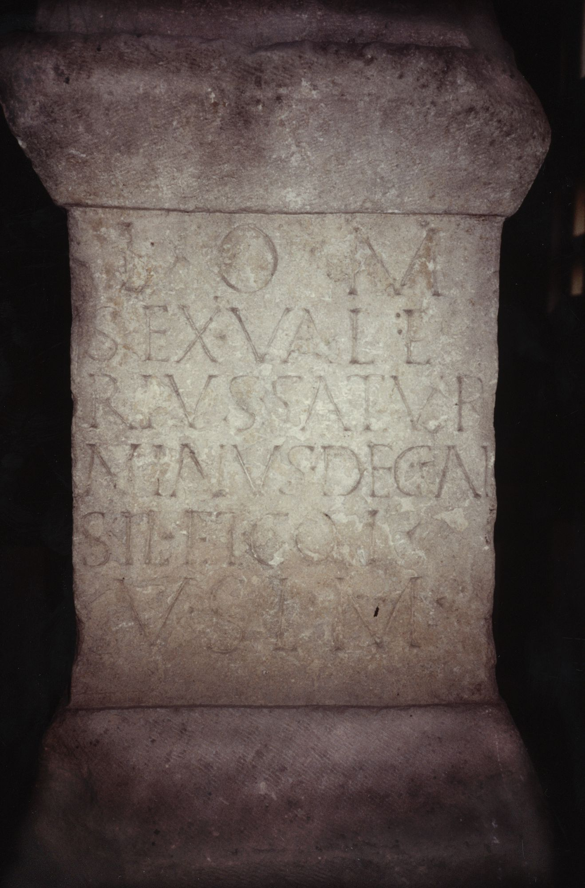

# EDH HD048876. Gilău?

**Країна.** Румунія

**Провінція (код EDH).** Dac

**Сучасна назва.** Gilău?

**Координати.** 46.75,23.383332999

**Зберігання.** Cluj-Napoca, Muz. Naţ. Ist. Transilv.

**Датування (роки, від'ємні до н. е.).** 107 … 200

**Тип пам'ятки.** Altar

## Текст (латинь, скорочення розкрито)

```
I(ovi) O(ptimo) M(aximo) / Sex(tus) Vale/rius Satur/ninus dec(urio) al(ae) / Sil(ianae) et col(legae) / v(otum) s(olverunt) l(ibentes) m(erito)
```

## Текст у вихідному записі

```
I O M / SEX VALE / RIVS SATVR / NINVS DEC AL / SIL ET COL / V S L M
```

## Література

CIL 03, 00845. #

## Фото



Джерело https://edh.ub.uni-heidelberg.de/edh/inschrift/HD048876, ліцензія CC BY-SA 4.0. Оригінальний XML в архіві сирі_дані/edh_xml.zip
