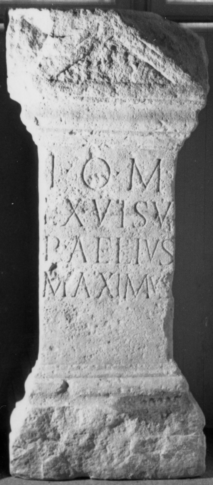

# EDH HD048885. Napoca

**Країна.** Румунія

**Провінція (код EDH).** Dac

**Місце знахідки (антична назва).** Napoca

**Сучасна назва.** Cluj-Napoca

**Деталі знахідки.** {Piața Unirii}

**Координати.** 46.769472395,23.589887502

**Зберігання.** Cluj-Napoca, Muz. Naţ. Ist. Transilv.

**Датування (роки, від'ємні до н. е.).** 107 … 200

**Тип пам'ятки.** Altar

## Текст (латинь, скорочення розкрито)

```
I(ovi) O(ptimo) M(aximo) / ex visu / P(ublius) Aelius / Maximus
```

## Текст у вихідному записі

```
I O M / EX VISV / P AELIVS / MAXIMVS
```

## Література

CIL 03, 00855. #

## Фото



Джерело https://edh.ub.uni-heidelberg.de/edh/inschrift/HD048885, ліцензія CC BY-SA 4.0. Оригінальний XML в архіві сирі_дані/edh_xml.zip
