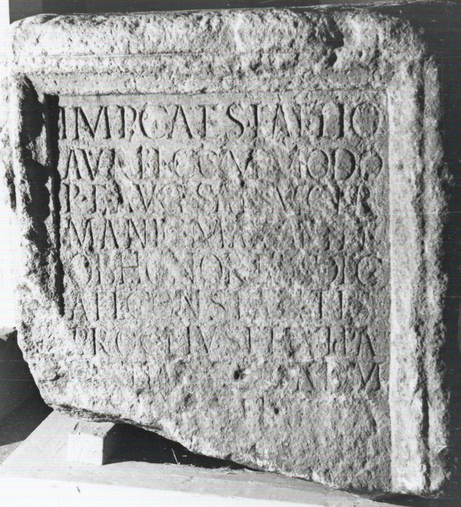

# EDH HD048893. Napoca

**Країна.** Румунія

**Провінція (код EDH).** Dac

**Місце знахідки (антична назва).** Napoca

**Сучасна назва.** Cluj-Napoca

**Деталі знахідки.** {alte Burg}

**Координати.** 46.771114786,23.588891029

**Рік знахідки.** 1791

**Датування (роки, від'ємні до н. е.).** 191 … 192

**Матеріал.** Gesteine

**Тип пам'ятки.** Statuenbasis?

## Текст (латинь, скорочення розкрито)

```
Imp(eratori) Caes(ari) L(ucio) Aelio / Aurel(io) Commodo / P(io) F(elici) Aug(usto) Sarm(atico) Ger/manic(o) max(imo) Britt(annico) / ob honorem dec(urionatus) / Ael(i) Constantis / proc(uratoris) eius et Iul(i) Pa/[c]atiani quondam / [pro]c(uratoris)(?) T(itus)(?) F[l(avius)](?) Ianua/[rius ---]R col(oniae) et / T(itus) Fl(avius) Germanus / dec(urio) col(oniae) quod dec(uriones) / alares promise/runt pecunia su/a posuerunt [l(ocus)] d(atus) / d(ecreto) d(ecurionum)
```

## Текст у вихідному записі

```
IMP CAES L AELIO / AVREL COMMODO / P F AVG SARM GER / MANIC MAX BRITT / OB HONOREM DEC / AEL CONSTANTIS / PROC EIVS ET IVL PA / [ ]ATIANI QVONDAM / [ ]C T F[ ] IANVA / [ ]R COL ET / T FL GERMANVS / DEC COL QVOD DEC / ALARES PROMISE / RVNT PECVNIA SV / A POSVERVNT [ ] D / D D
```

## Коментар

Mittelteil eines Altars oder einer Statuenbasis.

## Література

CIL 03, 00865. #

## Фото



Джерело https://edh.ub.uni-heidelberg.de/edh/inschrift/HD048893, ліцензія CC BY-SA 4.0. Оригінальний XML в архіві сирі_дані/edh_xml.zip
