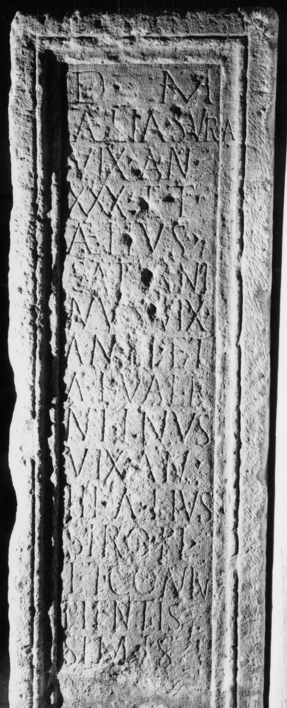

# EDH HD048961. Napoca

**Країна.** Румунія

**Провінція (код EDH).** Dac

**Місце знахідки (антична назва).** Napoca

**Сучасна назва.** Cluj-Napoca

**Координати.** 46.771741,23.576094000

**Зберігання.** Cluj-Napoca, Muz. Naţ. Ist. Transilv.

**Датування (роки, від'ємні до н. е.).** 171 … 270

**Тип пам'ятки.** Altar?

## Текст (латинь, скорочення розкрито)

```
D(is) M(anibus) / Aelia Sura / vix(it) an(nos) / XXX et / Aelius / Saturni/nus vix(it) / an(nos) III et / Ael(ius) Vale/ntinus / vix(it) an(nos) / III Aelius / Siro fi(liis) / et coniu(gi) / pientis/simis
```

## Текст у вихідному записі

```
D M / AELIA SVRA / VIX AN / XXX ET / AELIVS / SATVRNI / NVS VIX / AN III ET / AEL VALE / NTINVS / VIX AN / III AELIVS / SIRO FI / ET CONIV / PIENTIS / SIMIS
```

## Коментар

Tafel oder Mittelteil eines Altars oder einer Statuenbasis. Z. 2 (Ende): Buchstabe A steht auf dem Rahmen.

## Література

CIL 03, 00873. #

## Фото



Джерело https://edh.ub.uni-heidelberg.de/edh/inschrift/HD048961, ліцензія CC BY-SA 4.0. Оригінальний XML в архіві сирі_дані/edh_xml.zip
