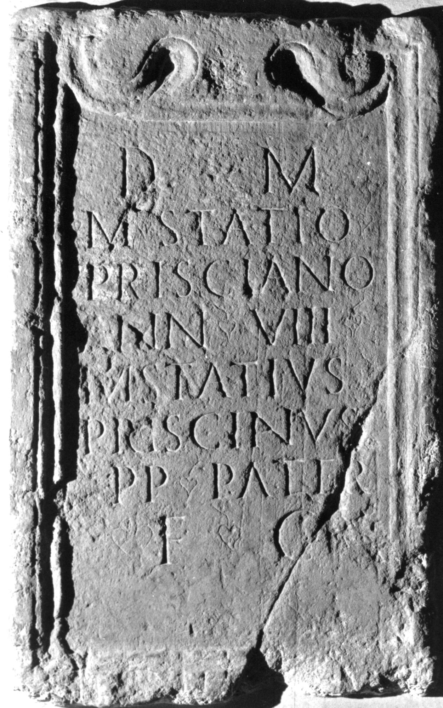

# EDH HD049068. Potaissa, aus?

**Країна.** Румунія

**Провінція (код EDH).** Dac

**Місце знахідки (антична назва).** Potaissa, aus?

**Сучасна назва.** Luna

**Координати.** 46.5055556,23.921111099

**Зберігання.** Wien, Nationalbibl.

**Датування (роки, від'ємні до н. е.).** 151 … 270

**Тип пам'ятки.** Altar?

**Розміри (висота, ширина, глибина, см).** 114.0 × 73.0

## Текст (латинь, скорочення розкрито)

```
D(is) M(anibus) / M(arco) Statio / Prisciano / ann(orum) VIII / M(arcus) Statius / Priscianus / p(rimus) p(ilus) pater / f(aciendum) c(uravit)
```

## Текст у вихідному записі

```
D M / M STATIO / PRISCIANO / ANN VIII / M STATIVS / PRISCIANVS / P P PATER / F C
```

## Коментар

Wohl der Mittelteil eines Altars oder einer Statuenbasis. Hederae.

## Література

CIL 03, 00910.
- A. Buonopane - V. La Monaca, in: G.P. Marchi - J. Pál (Hrsg.), Epigrafi romane di Transilvania. Bibliotheca Capitolare di Verona, Manoscritto CCLXVII (Verona - Szeged 2010) 295, Nr. 42; Foto u. Zeichnung. #

## Фото



Джерело https://edh.ub.uni-heidelberg.de/edh/inschrift/HD049068, ліцензія CC BY-SA 4.0. Оригінальний XML в архіві сирі_дані/edh_xml.zip
