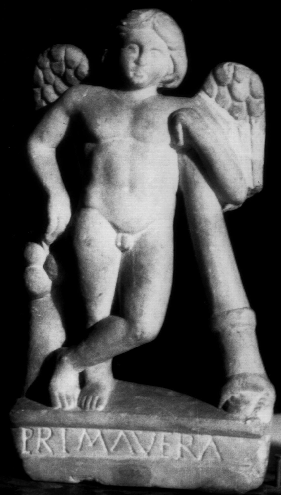

# EDH HD049305. Apulum

**Країна.** Румунія

**Провінція (код EDH).** Dac

**Місце знахідки (антична назва).** Apulum

**Сучасна назва.** Alba Iulia

**Деталі знахідки.** {Partoş}

**Координати.** 46.0463184,23.566650100

**Зберігання.** Cluj-Napoca, Muz. Naţ. Ist. Transilv.

**Датування (роки, від'ємні до н. е.).** 107 … 270

**Матеріал.** Marmor

**Тип пам'ятки.** Relief?

**Розміри (висота, ширина, глибина, см).** 28.5 × 16.0 × 5.0

## Текст (латинь, скорочення розкрито)

```
Prima vera
```

## Текст у вихідному записі

```
PRIMA VERA
```

## Коментар

Die Inschrift auf der Basis der - sehr wahrscheinlich antiken - Hypnos-Thanatos- Statuette stammt vermutlich aus dem 16. Jh.

## Література

CIL 03, 07783.
- IDR 3, 5, 019*; Foto. #

## Фото



Джерело https://edh.ub.uni-heidelberg.de/edh/inschrift/HD049305, ліцензія CC BY-SA 4.0. Оригінальний XML в архіві сирі_дані/edh_xml.zip
