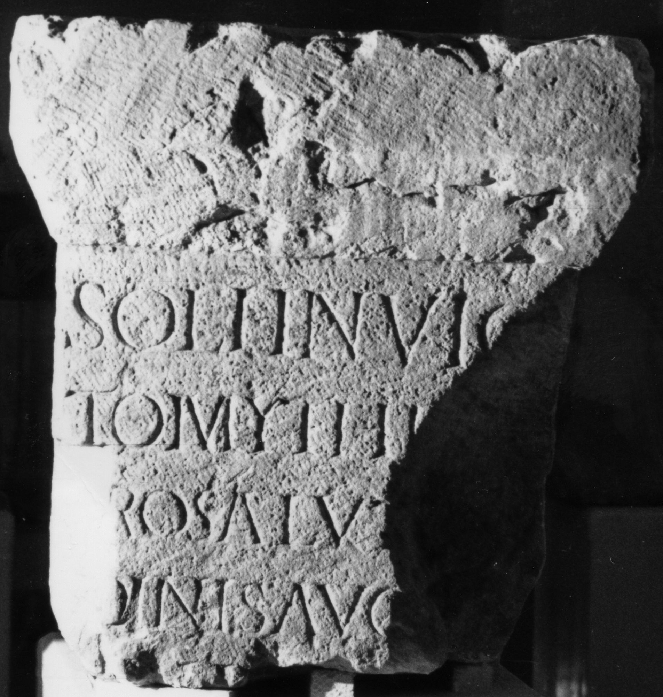

# EDH HD049327. Napoca

**Країна.** Румунія

**Провінція (код EDH).** Dac

**Місце знахідки (антична назва).** Napoca

**Сучасна назва.** Cluj-Napoca

**Деталі знахідки.** {S. Mihail, Kirche}

**Координати.** 46.769951202,23.589517927

**Зберігання.** Cluj-Napoca, Muz. Naţ. Ist. Transilv.

**Датування (роки, від'ємні до н. е.).** 107 … 270

**Розміри (висота, ширина, глибина, см).** 85.0

## Текст (латинь, скорочення розкрито)

```
Soli Invic/to M<i=Y>thr[ae]#M<i>thr[ae]#MYTHR / [p]ro salut[e] / [or]dinis Aug[---] / [&
```

## Текст у вихідному записі

```
SOLI INVIC / TO MYTHR[ ] / [ ]RO SALVT[ ] / [ ]DINIS AVG[ ] / [
```

## Література

CIL 03, 14466; Zeichnung. #

## Фото



Джерело https://edh.ub.uni-heidelberg.de/edh/inschrift/HD049327, ліцензія CC BY-SA 4.0. Оригінальний XML в архіві сирі_дані/edh_xml.zip
