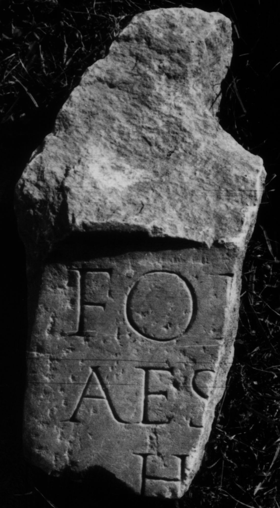

# EDH HD049344. Colonia Ulpia Traiana Sarmizegetusa

**Країна.** Румунія

**Провінція (код EDH).** Dac

**Місце знахідки (антична назва).** Colonia Ulpia Traiana Sarmizegetusa

**Сучасна назва.** Sarmizegetusa

**Координати.** 45.516666699,22.783333299

**Зберігання.** Deva, Muz. Civil. Dac. şi Rom.

**Датування (роки, від'ємні до н. е.).** 107 … 270

**Матеріал.** Marmor?

**Тип пам'ятки.** Altar

**Розміри (висота, ширина, глибина, см).** -34.0 × -16.0 × -9.0

## Текст (латинь, скорочення розкрито)

```
Fon[tibus] / Aes[culapi et] / H[ygiae &
```

## Текст у вихідному записі

```
FON[ ] / AES[ ] / H[
```

## Коментар

(B): Z. 1-2: CIL: For[tunae] / Aes[culapio].

## Література

IDR 3, 2, 183; Zeichnung.
- CIL 03, 12579. (B) #

## Фото



Джерело https://edh.ub.uni-heidelberg.de/edh/inschrift/HD049344, ліцензія CC BY-SA 4.0. Оригінальний XML в архіві сирі_дані/edh_xml.zip
