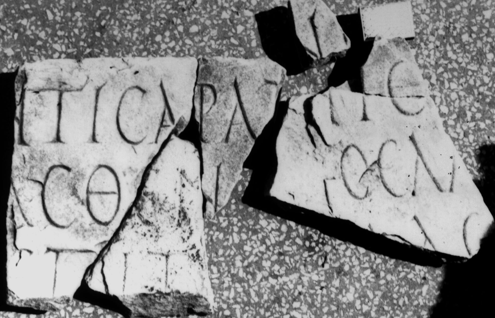

# EDH HD049428. Colonia Ulpia Traiana Sarmizegetusa

**Країна.** Румунія

**Провінція (код EDH).** Dac

**Місце знахідки (антична назва).** Colonia Ulpia Traiana Sarmizegetusa

**Сучасна назва.** Sarmizegetusa

**Деталі знахідки.** Praetorium procuratoris, area sacra, {Serapeum}

**Координати.** 45.515011988,22.787640094

**Рік знахідки.** 1883

**Зберігання.** Deva, Muz. Civil. Dac. şi Rom.

**Датування (роки, від'ємні до н. е.).** 211 … 217

**Тип пам'ятки.** Tafel

**Розміри (висота, ширина, глибина, см).** 56.0 × -160.0 × 3.5

## Текст (латинь, скорочення розкрито)

```
Ζηνὶ θ[εῶ?]ν π[άντων? κρατοῦ]ντι Σαράπ[ιδι?] Κάσ[σ]ιος Αλ[--- κατασκευ?]ασθέν[τα ἐπὶ?] ΑΙ[--]ΛΑϹ[---] ἐπιτ[ρόπου?]
```

## Текст у вихідному записі

```
ΖΗΝΙ Θ[ ]Ν Π[ ]ΝΤΙ ΣΑΡΑΠ[ ] ΚΑΣ[ ]ΙΟΣ ΑΛ[ ]ΑΣΘΕΝ[ ] ΑΙ[ ]ΛΑϹ[ ] ΕΠΙΤ[ ]
```

## Коментар

7 Fragmente, wovon jeweils 3 aneinanderpassende zwei separate Gebilde (a u. c) gestalten. Ein kleines Fragment (b) bleibt. Tabula ansata. Fundstelle bezieht sich auf die neu gefundenen Fragmente.

## Література

CIL 03, 07995.
- IDR 3, 2, 068; fig. 56 (Foto u. Zeichnung).
- AE 1998, 1089.
- I. Piso, ZPE 120, 1998, 257-258, Nr. 2; Abb. 4; Abb. 5 (Zeichnung). - AE 1998.
- SEG 48, 0985. #

## Фото



Джерело https://edh.ub.uni-heidelberg.de/edh/inschrift/HD049428, ліцензія CC BY-SA 4.0. Оригінальний XML в архіві сирі_дані/edh_xml.zip
