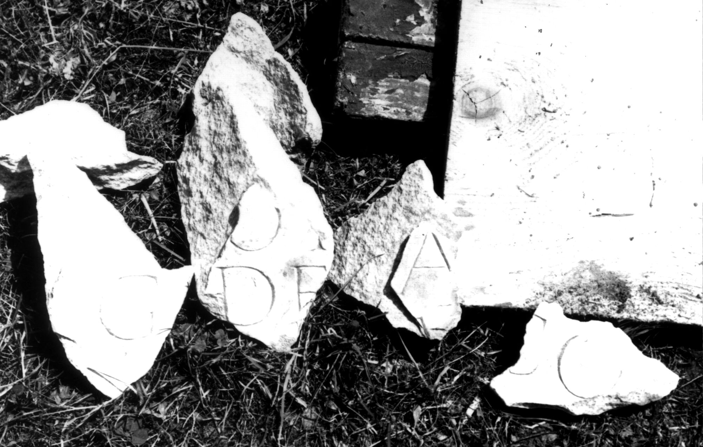

# EDH HD049486. Colonia Ulpia Traiana Sarmizegetusa

**Країна.** Румунія

**Провінція (код EDH).** Dac

**Місце знахідки (антична назва).** Colonia Ulpia Traiana Sarmizegetusa

**Сучасна назва.** Sarmizegetusa

**Координати.** 45.516666699,22.783333299

**Зберігання.** Sarmizegetusa, Muz. Arh.

**Датування (роки, від'ємні до н. е.).** 151 … 250

## Текст (латинь, скорочення розкрито)

```
$]G[& // $]OI(?)[---] / [---]DE[& // $]A[---] / [---]V[& // $]CO[&
```

## Текст у вихідному записі

```
]G[ / / ]OI[ ] / [ ]DE[ / / ]A[ ] / [ ]V[ / / ]CO[
```

## Коментар

4 nicht aneinanderpassende Fragmente derselben(?) Inschrift erhalten.

## Література

IDR 3, 2, 520a-d; fig. 386. #

## Фото



Джерело https://edh.ub.uni-heidelberg.de/edh/inschrift/HD049486, ліцензія CC BY-SA 4.0. Оригінальний XML в архіві сирі_дані/edh_xml.zip
