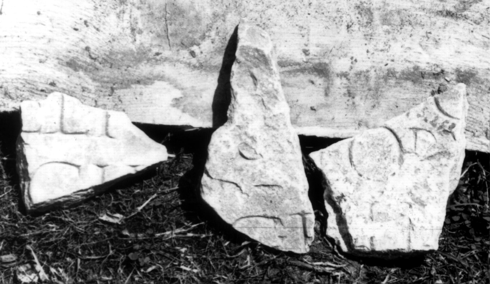

# EDH HD049495. Colonia Ulpia Traiana Sarmizegetusa

**Країна.** Румунія

**Провінція (код EDH).** Dac

**Місце знахідки (антична назва).** Colonia Ulpia Traiana Sarmizegetusa

**Сучасна назва.** Sarmizegetusa

**Координати.** 45.516666699,22.783333299

**Зберігання.** Sarmizegetusa, Muz. Arh.

**Датування (роки, від'ємні до н. е.).** 107 … 275

## Текст (латинь, скорочення розкрито)

```
$](?) / [---]ELI(?)[---] / [---]CII(?)[---] / [&? // $] / [---]S[---] / [---]C(?) F(?)[---] / [&? // $](?) / [---]O(?)[---] / [---]eoru[---] / [---]I(?)I(?)[---] / [&?
```

## Текст у вихідному записі

```
] / [ ]ELI[ ] / [ ]CII[ ] / [ / / ] / [ ]S[ ] / [ ]C F[ ] / [ / / ] / [ ]O[ ] / [ ]EORV[ ] / [ ]II[ ] / [
```

## Коментар

3 nicht aneinanderpassende Fragmente derselben(?) Inschrift erhalten.

## Література

IDR 3, 2, 529 a-c; fig. 387. #

## Фото



Джерело https://edh.ub.uni-heidelberg.de/edh/inschrift/HD049495, ліцензія CC BY-SA 4.0. Оригінальний XML в архіві сирі_дані/edh_xml.zip
