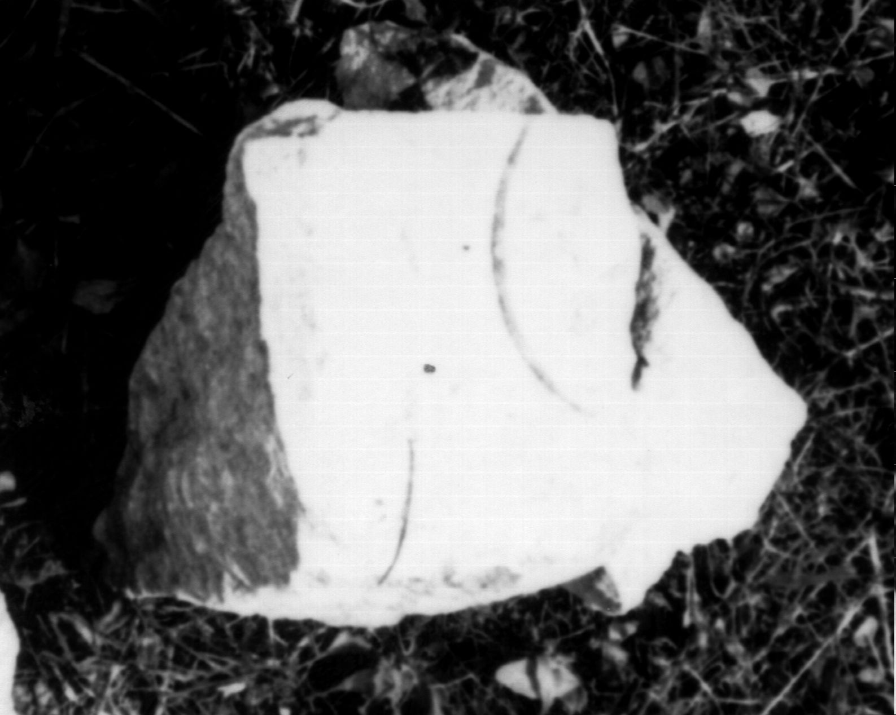

# EDH HD049496. Colonia Ulpia Traiana Sarmizegetusa

**Країна.** Румунія

**Провінція (код EDH).** Dac

**Місце знахідки (антична назва).** Colonia Ulpia Traiana Sarmizegetusa

**Сучасна назва.** Sarmizegetusa

**Координати.** 45.516666699,22.783333299

**Зберігання.** Sarmizegetusa, Muz. Arh.

**Датування (роки, від'ємні до н. е.).** 107 … 275

## Текст (латинь, скорочення розкрито)

```
$]O[&
```

## Текст у вихідному записі

```
]O[
```

## Література

IDR 3, 2, 530; fig. 387. #

## Фото



Джерело https://edh.ub.uni-heidelberg.de/edh/inschrift/HD049496, ліцензія CC BY-SA 4.0. Оригінальний XML в архіві сирі_дані/edh_xml.zip
