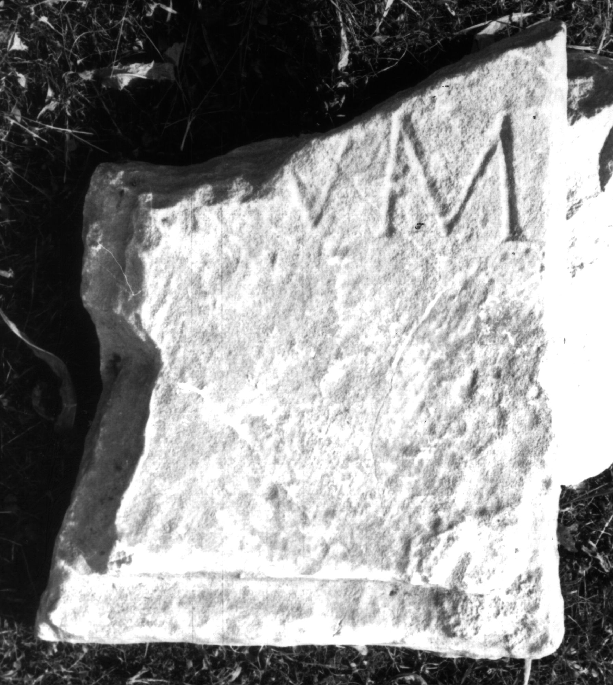

# EDH HD049502. Colonia Ulpia Traiana Sarmizegetusa

**Країна.** Румунія

**Провінція (код EDH).** Dac

**Місце знахідки (антична назва).** Colonia Ulpia Traiana Sarmizegetusa

**Сучасна назва.** Sarmizegetusa

**Координати.** 45.516666699,22.783333299

**Зберігання.** Sarmizegetusa, Muz. Arh.

**Датування (роки, від'ємні до н. е.).** 107 … 230

## Текст (латинь, скорочення розкрито)

```
$] / [---]I(?)VM[---]
```

## Текст у вихідному записі

```
] / [ ]IVM[ ]
```

## Коментар

Unterhalb der Inschrift noch der Rest vom Rahmen des Inschriftfeldes erhalten.

## Література

IDR 3, 2, 536; fig. 387. #

## Фото



Джерело https://edh.ub.uni-heidelberg.de/edh/inschrift/HD049502, ліцензія CC BY-SA 4.0. Оригінальний XML в архіві сирі_дані/edh_xml.zip
