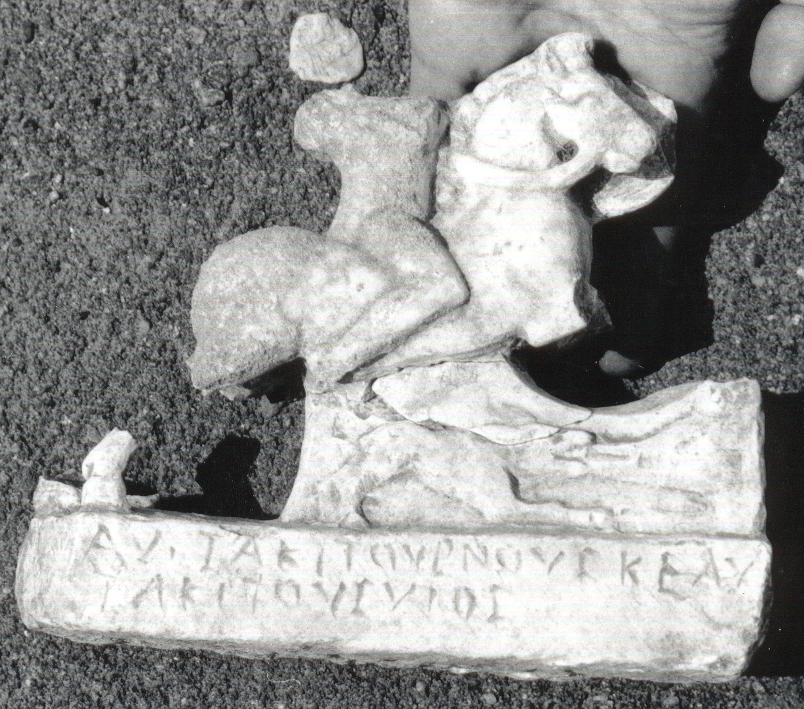

# EDH HD049506. Apulum

**Країна.** Румунія

**Провінція (код EDH).** Dac

**Місце знахідки (антична назва).** Apulum

**Сучасна назва.** Alba Iulia

**Деталі знахідки.** {Partoş}, Tempel des Liber Pater

**Координати.** 46.050245046,23.564944519

**Рік знахідки.** 1990

**Зберігання.** Alba Iulia, Muz. Unirii

**Датування (роки, від'ємні до н. е.).** 212 … 275

**Матеріал.** Marmor

**Тип пам'ятки.** Statue

**Розміри (висота, ширина, глибина, см).** 17.0 × 19.5 × 5.0

## Текст (латинь, скорочення розкрито)

```
Αὐ(ρήλιος) Τακιτούρνους κὲ Αὐ(ρήλιος) / Τακίτους υἱός
```

## Текст у вихідному записі

```
ΑΥ ΤΑΚΙΤΟΥΡΝΟΥΣ ΚΕ ΑΥ / ΤΑΚΙΤΟΥΣ ΥΙΟΣ
```

## Література

SEG 47, 1162.
- IDR 3, 5, 370; Foto.
- SEG 52, 0728. #

## Фото



Джерело https://edh.ub.uni-heidelberg.de/edh/inschrift/HD049506, ліцензія CC BY-SA 4.0. Оригінальний XML в архіві сирі_дані/edh_xml.zip
