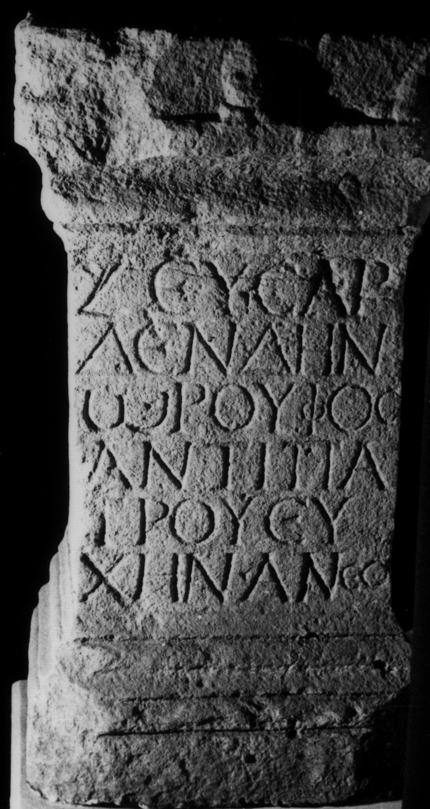

# EDH HD049507. Apulum

**Країна.** Румунія

**Провінція (код EDH).** Dac

**Місце знахідки (антична назва).** Apulum

**Сучасна назва.** Alba Iulia

**Деталі знахідки.** {Partoş}

**Координати.** 46.0463184,23.566650100

**Рік знахідки.** 1872

**Зберігання.** Cluj-Napoca, Muz. Naţ. Ist. Transilv.

**Датування (роки, від'ємні до н. е.).** 101 … 200

**Матеріал.** Kalkstein

**Тип пам'ятки.** Altar

**Розміри (висота, ширина, глибина, см).** 72.0 × 40.0 × 38.0

## Текст (латинь, скорочення розкрито)

```
Ζεῦ Σαρ/δενδην/ῳ Ῥοῦφος / Ἀντιπά/τρου εὐ/χὴν ἀνέθ(ηκεν)
```

## Текст у вихідному записі

```
ΖΕΥ ΣΑΡ / ΔΕΝΔΗΝ / Ω ΡΟΥΦΟΣ / ΑΝΤΙΠΑ / ΤΡΟΥ ΕΥ / ΧΗΝ ΑΝΕΘ
```

## Література

CIL 03, 07762.
- IGR 1, 0545.
- IDR 3, 5, 229; Foto. #

## Фото



Джерело https://edh.ub.uni-heidelberg.de/edh/inschrift/HD049507, ліцензія CC BY-SA 4.0. Оригінальний XML в архіві сирі_дані/edh_xml.zip
