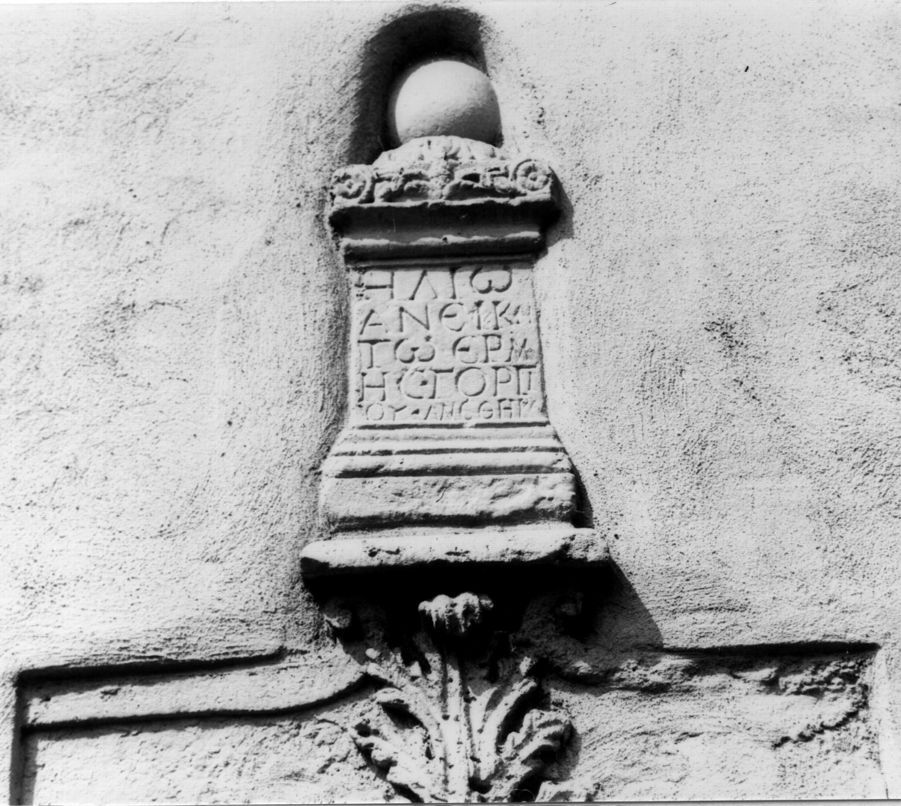

# EDH HD049510. Apulum

**Країна.** Румунія

**Провінція (код EDH).** Dac

**Місце знахідки (антична назва).** Apulum

**Сучасна назва.** Alba Iulia

**Координати.** 46.0669444,23.569999999

**Зберігання.** Alba Iulia, katholischer Bischofssitz

**Датування (роки, від'ємні до н. е.).** 101 … 200

**Матеріал.** Marmor

**Тип пам'ятки.** Altar

**Розміри (висота, ширина, глибина, см).** 52.0 × 30.0

## Текст (латинь, скорочення розкрито)

```
Ἡλίῳ / ἀνεική/τῳ Ἑρμ/ῆς Γοργί/ου ἀνέθηκε
```

## Текст у вихідному записі

```
ΗΛΙΩ / ΑΝΕΙΚΗ / ΤΩ ΕΡΜ / ΗΣ ΓΟΡΓΙ / ΟΥ ΑΝΕΘΗΚΕ
```

## Література

CIG 6813b.
- CIL 03, 07781.
- IDR 3, 5, 355; Foto. #

## Фото



Джерело https://edh.ub.uni-heidelberg.de/edh/inschrift/HD049510, ліцензія CC BY-SA 4.0. Оригінальний XML в архіві сирі_дані/edh_xml.zip
