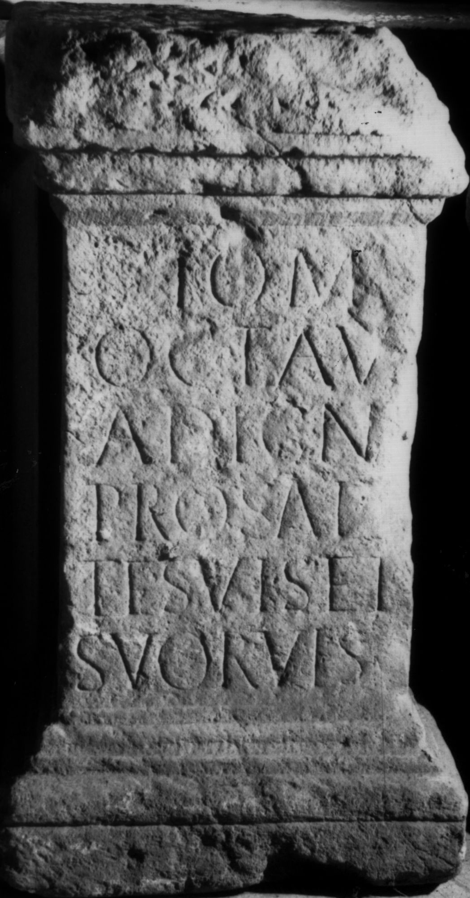

# EDH HD049790. Apulum, aus?

**Країна.** Румунія

**Провінція (код EDH).** Dac

**Місце знахідки (антична назва).** Apulum, aus?

**Сучасна назва.** Vinţu de Jos

**Деталі знахідки.** {Schloß Martinuzzi}

**Координати.** 45.996976524,23.478899002

**Рік знахідки.** 1899

**Зберігання.** Alba Iulia, Muz. Unirii

**Датування (роки, від'ємні до н. е.).** 107 … 270

**Матеріал.** Kalkstein

**Тип пам'ятки.** Altar

**Розміри (висота, ширина, глибина, см).** 79.0 × 41.0 × 35.0

## Текст (латинь, скорочення розкрито)

```
I(ovi) O(ptimo) M(aximo) / Octavi/a Digna / pro salu/te suis et / suor(um) v(otum) l(ibens) s(olvit) m(erito)
```

## Текст у вихідному записі

```
I O M / OCTAVI / A DIGNA / PRO SALV / TE SVIS ET / SVOR V L S M
```

## Література

IDR 3, 5, 158; Foto.
- CIL 03, 14473. #

## Фото



Джерело https://edh.ub.uni-heidelberg.de/edh/inschrift/HD049790, ліцензія CC BY-SA 4.0. Оригінальний XML в архіві сирі_дані/edh_xml.zip
