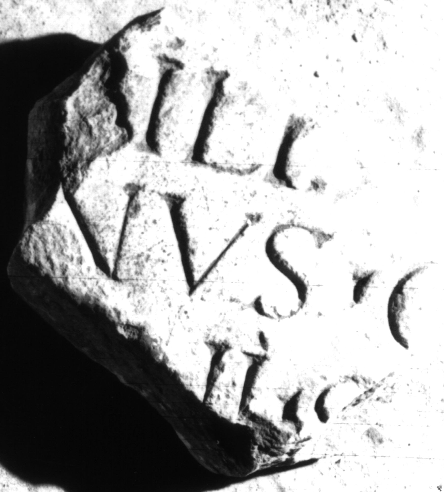
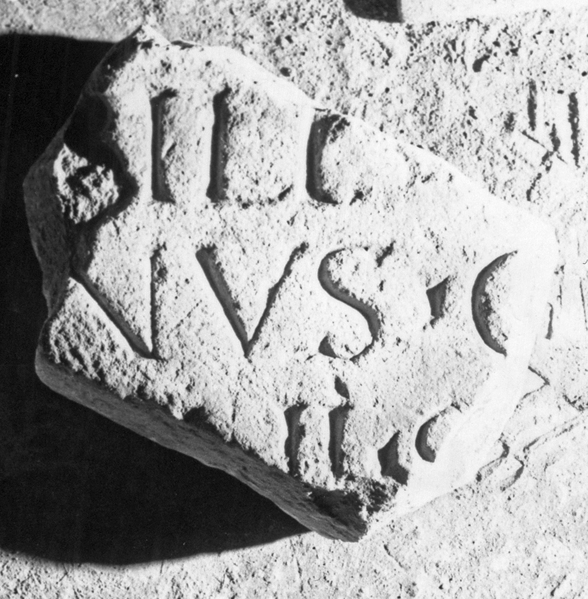

# EDH HD050025. Apulum

**Країна.** Румунія

**Провінція (код EDH).** Dac

**Місце знахідки (антична назва).** Apulum

**Сучасна назва.** Alba Iulia

**Координати.** 46.0669444,23.569999999

**Зберігання.** Alba Iulia, Muz. Unirii

**Датування (роки, від'ємні до н. е.).** 131 … 200

**Розміри (висота, ширина, глибина, см).** -19.0 × -15.0 × 7.0

## Текст (латинь, скорочення розкрито)

```
$] / [---]B(?)ILI(?) [---] / [---]nus C(?)[---] / [---]I(?)I(?) S[---] / [&
```

## Текст у вихідному записі

```
] / [ ]BILI [ ] / [ ]NVS C[ ] / [ ]II S[ ] / [
```

## Коментар

Fundstelle: Băluţă: südöstlich der Thermen der ""colonia Nova"".

## Література

C.L. Băluţă, Apulum 21, 1983, 101, Nr. 21; fig. 21 (Foto u. Zeichnung). #

## Фото





Джерело https://edh.ub.uni-heidelberg.de/edh/inschrift/HD050025, ліцензія CC BY-SA 4.0. Оригінальний XML в архіві сирі_дані/edh_xml.zip
