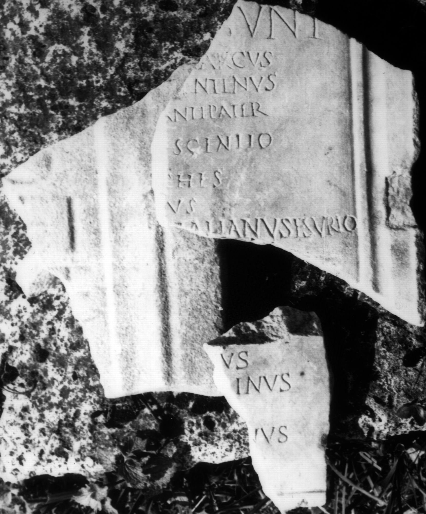

# EDH HD071679. Colonia Ulpia Traiana Sarmizegetusa

**Країна.** Румунія

**Провінція (код EDH).** Dac

**Місце знахідки (антична назва).** Colonia Ulpia Traiana Sarmizegetusa

**Сучасна назва.** Sarmizegetusa

**Деталі знахідки.** {Tempel der palmyrenischen Götter / sog. Gebäude Y, östliche Porticus}, bei

**Координати.** 45.513102399,22.787221669

**Рік знахідки.** 1924

**Зберігання.** Sarmizegetusa, Muz. Arh.

**Датування (роки, від'ємні до н. е.).** 201 … 270

**Матеріал.** Marmor

**Тип пам'ятки.** Tafel

**Розміри (висота, ширина, глибина, см).** -20.0 × -10.0 × 4.0

## Текст (латинь, скорочення розкрито)

```
Cult[ores dei? Solis? Ma]/lagb[eli --- Pro?]/culu[s? ---]a / [--- exst]rux(erunt) / quo[rum nomina subscripta] sunt // Sped(ius) V[---] / col(oniae) / Marcu[s ---] / M(arcus) Aur(elius) Iu[---] / Sped(ius) [---]anu[s] / S[ped(ius)? ---] Aug(ustalis) col(oniae) / Pom[poni(us)?] Avitus / Val(erius) [---]nus / Sped(ius) Primanus [qui? et?] Rex / Aurel(ius) Aquilinus / Aurel(ius) Zopyrus / Comini(us) Maximinus / Aurel(ius) Viator / Aurel(ius) Marcianus / Ant(onius) Barbas / Ael(ius) Geminus / [& // [--- M]arcus / [--- Val]entinus / [---] Antipater / [---] Crescentio / [---] Eutyches / Val(erius) Rufus / Aurel(ius) V[i]talianus Esurio / Domitius I(?)[---]
```

## Текст у вихідному записі

```
CVLT[ ] / LAGB[ ] / CVLV[ ]A / [ ]RVX / QVO[ ] SVNT / / SPED V[ ] / COL / MARCV[ ] / M AVR IV[ ] / SPED [ ]ANV[ ] / S[ ] AVG COL / POM[ ] AVITVS / VAL [ ]NVS / SPED PRIMANVS [ ] REX / AVREL AQVILINVS / AVREL ZOPYRVS / COMINI MAXIMINVS / AVREL VIATOR / AVREL MARCIANVS / ANT BARBAS / AEL GEMINVS / [ / / [ ]ARCVS / [ ]ENTINVS / [ ] ANTIPATER / [ ] CRESCENTIO / [ ] EVTYCHES / VAL RVFVS / AVREL V[ ]TALIANVS ESVRIO / DOMITIVS I[ ]
```

## Коментар

Fundjahre: von 1924 bis 2010. 13, teilweise aneinanderpassende Fragmente; Maße beziehen sich auf das Fragment oben links; Maße der Fragmentgruppe der linken unteren Ecke: (48) x (31) x 3,5 cm; Fragmentgruppe mit Teil des rechten Rahmens: (41) x (34) x 3, 5 cm. Ein weiteres, 1924 gefundenes und verschollenes Fragment (IDR 3, 2, 065b) ist nicht sicher zugehörig. Rekonstruierte Maße: circa 150 x 120 cm. Die Namensliste unterhalb von Z. 1-5 ist in zwei Kolumnen angeordnet. Col. I: Z. 9: möglicherweise auch [inter]rex. (B): Col. I: Piso - Ţentea, Dacia 55, 2011; AE 2011: Z. 8: Prim[anus]; Z. 9: Aqui[linus]; Piso, in: In: H. Pop u. a. (Hrsg.), Identităţi; Piso - Ţentea, Dacia 55, 2011; AE 2011: Z. 14: nicht angegeben.

## Література

AE 2011, 1085. (B)
- I. Piso - O. Ţentea, Dacia 55, 2011, 118-121, Nr. 3; fig. 6; fig. 7 (Zeichnung). (B) - AE 2011.
- I. Piso, in: H. Pop - I. Bejinariu - S. Băcueţ-Crişan - D. Băcueţ-Crişan (Hrsg.), Identităţi culturale locale şi regionale în context european. Studii Studii de arheologie şi antropologie istorică (Cluj-Napoca 2010) 439-442; fig. 1; fig. 2 (Zeichnung). (B)
- IDR 3, 2, 065a u. c; fig. 53 a u. c (Fotos u. Zeichnungen).
- IDR 3, 2, 484; fig. 375 (Foto u. Zeichnung). #

## Фото



Джерело https://edh.ub.uni-heidelberg.de/edh/inschrift/HD071679, ліцензія CC BY-SA 4.0. Оригінальний XML в архіві сирі_дані/edh_xml.zip
