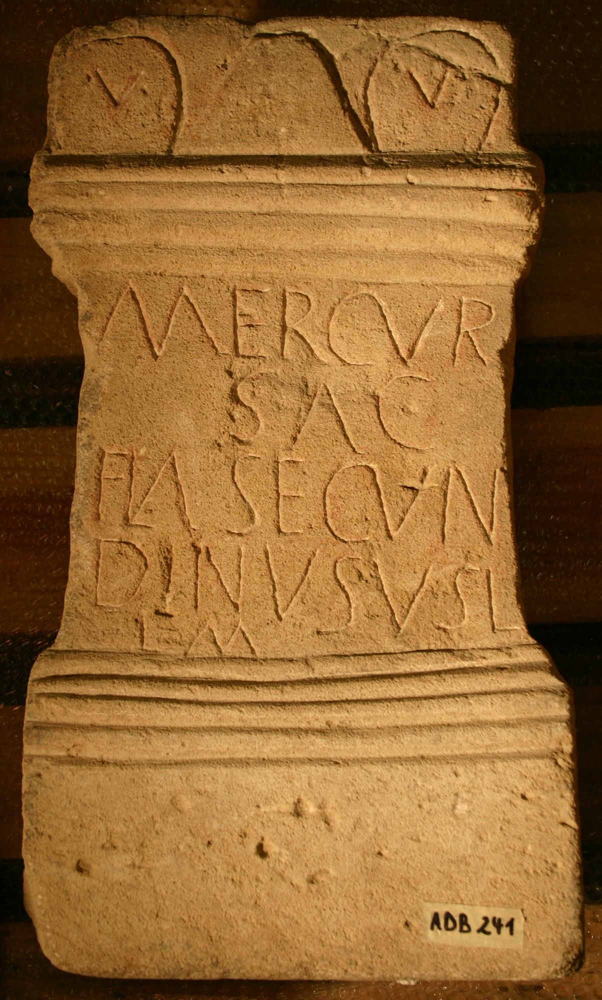

# EDH HD072894. Tropaeum Traiani, bei

**Країна.** Румунія

**Провінція (код EDH).** MoI

**Місце знахідки (антична назва).** Tropaeum Traiani, bei

**Сучасна назва.** Crangu

## Текст (латинь, скорочення розкрито)

```
[Dd(ominis)] nn(ostris) Dioclet/[iano] et Maximi[ano] / Invicti<s> A[ugg(ustis) et Co]nstan[tio et] / [Maxi]miano [nobilis]/[si]mis Caes[saribus] /[---]MIIIAIASS[---] / m(ilia) p(assuum) III
```

## Текст у вихідному записі

```
[ ] NN DIOCLET / [ ] ET MAXIMI[ ] / INVICTI A[ ]NSTAN[ ] / [ ]MIANO [ ] / [ ]MIS CAES[ ] / [ ]MIIIAIASS[ ] / M P III
```

## Література

AE 2009, 1209. #

## Фото



Джерело https://edh.ub.uni-heidelberg.de/edh/inschrift/HD072894, ліцензія CC BY-SA 4.0. Оригінальний XML в архіві сирі_дані/edh_xml.zip
